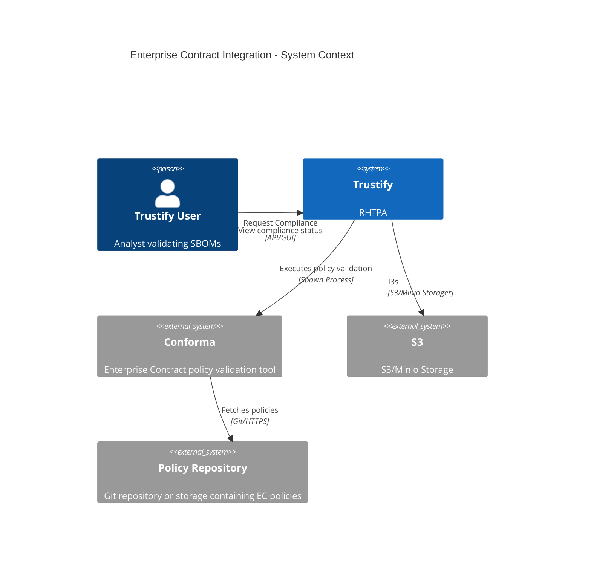
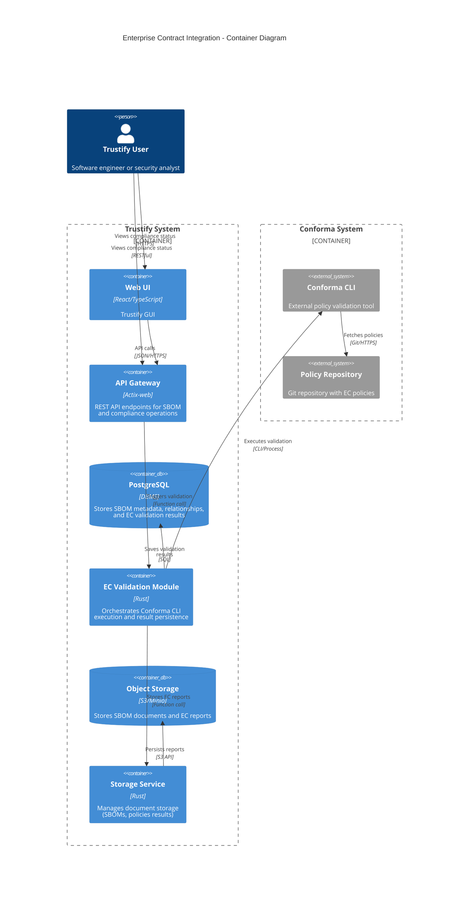
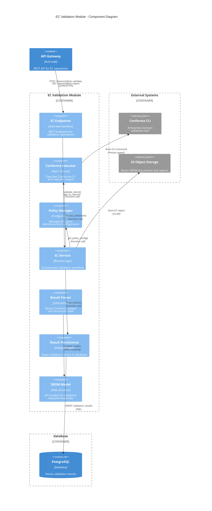

# 00012. Enterprise Contract Integration

Date: 2026-02-03

## Status

PROPOSED

## Context

Organizations need to enforce security and compliance policies across their software supply chain to ensure that all software components meet specific criteria for licensing, vulnerabilities, and provenance. Currently, Trustify provides SBOM storage, analysis, and vulnerability tracking, but lacks automated policy enforcement capabilities.

Manual validation of SBOMs against organizational policies is:

- Time-consuming and error-prone
- Inconsistent across teams and projects
- Difficult to scale across large numbers of SBOMs
- Lacks audit trails and historical compliance tracking
- Cannot provide real-time feedback on policy violations

### Requirements

Users need the ability to:

1. Automatically validate SBOMs against organizational policies
2. Define and manage multiple policy configurations
3. View compliance status and violation details for each SBOM
4. Track compliance history over time
5. Generate detailed compliance reports for auditing
6. Receive actionable feedback on policy violations

### Acceptance Criteria

For this integration to be considered successful, the following criteria must be met:

1. **Conforma Integration**: Trustify backend integrates with Conforma CLI to execute policy checks against stored SBOMs
2. **Policy Configuration**: Users/administrators can define or reference specific Enterprise Contract policies to enforce via the UI or API
3. **Result Persistence**: Conforma check output (Pass/Fail status and specific violations) is parsed and saved as structured properties on the corresponding SBOM record in the database
4. **Error Handling**: System gracefully handles execution failures (e.g., malformed SBOMs, policy timeouts, Conforma unavailable) and returns appropriate error messages
5. **Visibility**: Users can retrieve the compliance status of an SBOM via the Trustify API or UI, including historical validation results

### Available Solutions

**Enterprise Contract (Conforma)** is an open-source policy enforcement tool that:

- Validates SBOMs against configurable policies
- Supports policies for licensing, vulnerabilities, and provenance
- Provides structured output (JSON) for programmatic consumption
- Integrates with CI/CD pipelines
- Is open source
- Is actively maintained by Red Hat

**Current state**: Conforma provides a CLI tool but no REST API yet. Future API availability is expected but timeline is undetermined.

## Decision

We will integrate Enterprise Contract (Conforma) into Trustify as an optional validation service that:

1. **Executes Conforma CLI** via async process spawning using `tokio::process::Command`
2. **Stores validation results** as structured data in PostgreSQL with foreign key relationship to SBOMs
3. **Persists detailed reports** in object storage (S3/Minio) for audit trails
4. **Exposes REST API endpoints** for triggering validation and retrieving results
5. **Supports policy configuration** through database-backed policy references

### System Architecture



### Component Diagram - EC Validation Module



### Container Diagram



### Data Model

Two new tables:

**`ec_policies`** - Store policy references and metadata (not the policies themselves)

> **Note**: This table stores references to external policies (Git URLs, OCI registries, etc.) and local configuration metadata. The actual policy definitions remain in their external repositories (GitHub, GitLab, etc.) and are fetched by Conforma at validation time.

- `id` (UUID, PK)
- `name` (VARCHAR, unique) - User-friendly name for this policy configuration
- `description` (TEXT) - Description of what this policy enforces
- `policy_ref` (VARCHAR) - **External reference**: Git URL, OCI registry, or file path where policy is stored
- `policy_type` (VARCHAR) - 'git', 'oci', 'local' (indicates how Conforma should fetch the policy)
- `configuration` (JSONB) - Additional Conforma parameters (branch, tag, auth credentials, etc.)
- `created_at`, `updated_at` (TIMESTAMP)

**`ec_validation_results`** - Store validation outcomes

- `id` (UUID, PK)
- `sbom_id` (UUID, FK → sbom)
- `policy_id` (UUID, FK → ec_policies)
- `status` (VARCHAR) - 'pass', 'fail', 'error'
- `violations` (JSONB) - Structured violation data
- `summary` (JSONB) - Statistics (total checks, passed, failed, warnings)
- `report_url` (VARCHAR) - S3 URL to detailed report
- `executed_at` (TIMESTAMP)
- `execution_duration_ms` (INTEGER)
- `conforma_version` (VARCHAR)
- `error_message` (TEXT)

### API Endpoints

```
POST   /api/v2/sboms/{id}/ec-validate       # Trigger validation
GET    /api/v2/sboms/{id}/ec-report         # Get latest validation result
GET    /api/v2/sboms/{id}/ec-report/history # Get validation history
GET    /api/v2/ec/report/{result_id}        # Download detailed report
POST   /api/v2/ec/policies                  # Create policy reference (admin)
GET    /api/v2/ec/policies                  # List policy references
GET    /api/v2/ec/policies/{id}             # Get policy reference details
PUT    /api/v2/ec/policies/{id}             # Update policy reference (admin)
DELETE /api/v2/ec/policies/{id}             # Delete policy reference (admin)
```

### Implementation Approach

**Phase 1: Backend - CLI Integration**

- Use async process spawning with proper timeout handling
- Stream stdout/stderr for error capture
- Parse Conforma JSON output into Rust structs
- Handle exit codes (0=pass, 1=fail, 2=error)
- Implement REST API endpoints for validation operations
- Add database schema and migrations
- Create service layer for orchestration

**Phase 2: Frontend - GUI Development**

- **SBOM Details View Enhancements**:
  - Add "Validate with EC" button/action in SBOM detail page
  - Display compliance status badge (Pass/Fail/Error) prominently
  - Show latest validation timestamp and policy used
- **Validation Results Display**:
  - Create dedicated compliance tab/section in SBOM view
  - Display validation summary (total checks, passed, failed, warnings)
  - List violations with severity, description, and remediation hints
  - Provide expandable/collapsible violation details
- **Validation History**:
  - Show historical validation results in timeline view
  - Allow filtering by policy, status, and date range
  - Display trend charts for compliance over time
- **Policy Management UI** (Admin):
  - Policy reference configuration page (store Git URLs, OCI refs, etc.)
  - List view of available policy references with descriptions and types
  - Policy selection dialog when triggering validation
  - Form validation for policy references (validate Git URL format, test connectivity)
  - Display policy source (GitHub, GitLab, OCI registry) with clickable links
- **Report Download**:
  - Download button for detailed JSON/HTML reports
  - Preview detailed report in modal or new page
  - Export options (JSON, PDF, HTML)
- **Notifications & Feedback**:
  - Loading indicators during validation execution
  - Toast notifications for validation completion
  - Error messages with actionable guidance
  - Progress tracking for long-running validations

**Phase 3: Future API Migration**

When Conforma provides a REST API:

- Implement adapter pattern to switch between CLI and API
- Add feature flag `ec-api-mode` for gradual migration
- Maintain backward compatibility with CLI mode
- Deprecate CLI integration after stable API adoption
- No GUI changes required (transparent backend switch)

### Module Structure

```
modules/ec/
├── Cargo.toml
└── src/
    ├── lib.rs
    ├── endpoints/
    │   └── mod.rs              # REST endpoints
    ├── model/
    │   ├── mod.rs
    │   ├── policy.rs           # Policy API models
    │   └── validation.rs       # Validation result models
    ├── service/
    │   ├── mod.rs
    │   ├── ec_service.rs       # Main orchestration
    │   ├── policy_manager.rs   # Policy configuration
    │   ├── executor.rs         # Conforma CLI execution
    │   └── result_parser.rs    # Output parsing
    └── error.rs                # Error types
```

### Technical Considerations

**Conforma CLI Execution**

- Use `tokio::process::Command` for async execution to avoid blocking the runtime
- Stream stdout/stderr for real-time monitoring and logging
- Set execution timeouts (default: 5 minutes, configurable per policy)
- Handle large SBOM files efficiently by streaming to temporary files
- Capture exit codes for error handling (0=pass, 1=fail, 2+=error)
- Sanitize all CLI arguments to prevent injection attacks (use process args array, not shell strings)

**Policy Management**

- Support multiple policy types: Git repositories, OCI registries, local file paths
- Cache policy files locally to avoid repeated fetches from external sources
- Validate policy references before execution (check URL format, test connectivity)
- Track policy version/commit when storing validation results for reproducibility
- Support authentication for private policy repositories (tokens, SSH keys)

**Result Storage**

- Store structured violations in JSONB for efficient querying (filter by violation type, severity)
- Keep detailed reports in object storage (S3/Minio) to minimize database size
- Implement retention policies for old validation results (configurable, e.g., 90 days)
- Index frequently queried fields (sbom_id, status, executed_at) for performance
- Consider result aggregation for analytics dashboards

**Error Handling**

- Distinguish between validation failures (policy violations) and execution errors (CLI crashes)
- Provide actionable error messages to users (e.g., "Policy file not found at URL")
- Implement retry logic for transient failures (network timeouts, temporary service unavailability)
- Log all execution details for debugging (command, arguments, duration, exit code)
- Gracefully degrade when Conforma is unavailable (show cached results, queue for retry)

**Security**

- Validate and sanitize all user inputs (policy URLs, SBOM IDs)
- Restrict policy sources to trusted domains (configurable allowlist)
- Store authentication credentials securely (encrypted, never in logs)
- Implement proper authorization checks (only admins can modify policies)
- Audit log all validation executions and policy modifications

**Performance**

- Limit concurrent Conforma executions using semaphore (default: 5 concurrent)
- Implement queueing for validation requests during high load
- Cache policy files to reduce external network calls
- Use connection pooling for database operations
- Monitor execution times and resource usage for capacity planning
- Consider horizontal scaling for validation workloads

## Consequences

### Positive

1. **Automated Policy Enforcement**: Organizations can automatically validate SBOMs without manual review
2. **Audit Trail**: Complete history of compliance checks stored in database
3. **Flexibility**: Support multiple policy configurations for different requirements
4. **Integration Ready**: REST API enables integration with CI/CD pipelines
5. **Scalability**: Async execution prevents blocking on long-running validations
6. **Extensibility**: Module design allows future enhancement (webhooks, notifications, etc.)
7. **Open Source**: Conforma is open-source and actively maintained

### Negative

1. **External Dependency**: Requires Conforma CLI to be installed on Trustify servers
2. **Process Overhead**: Spawning external processes has performance implications
3. **Error Handling Complexity**: Must handle CLI failures, timeouts, and malformed output
4. **Version Management**: Need to track Conforma version compatibility
5. **Resource Usage**: Multiple concurrent validations may consume significant resources
6. **No Native API**: Until Conforma provides an API the CLI integration is less efficient than native API integration.

### Risks and Mitigations

| Risk                                | Mitigation                                                      |
| ----------------------------------- | --------------------------------------------------------------- |
| Conforma CLI unavailable/crashes    | Implement health checks, graceful error handling, retry logic   |
| Long execution times block requests | Use async execution with configurable timeouts (default: 5 min) |
| Large SBOMs cause memory issues     | Stream SBOM to temp file, pass file path to Conforma            |
| CLI injection attacks               | Sanitize all inputs, use process args array (not shell strings) |
| Version incompatibility             | Document required Conforma version, validate on startup         |
| Storage costs for reports           | Implement retention policies, compress reports                  |

### Migration Path

When Conforma REST API becomes available:

1. Implement API client alongside CLI executor
2. Add configuration flag to select execution mode
3. Gradually migrate workloads to API mode
4. Deprecate CLI mode after stability period
5. Remove CLI executor in future major version

### Performance Considerations

- **Concurrent Limits**: Implement semaphore to limit parallel Conforma executions (default: 5)
- **Timeout**: Default 5-minute timeout, configurable per policy
- **Caching**: Cache policy files to avoid repeated Git fetches
- **Async**: All operations non-blocking using Tokio runtime
- **Streaming**: Stream results incrementally for large reports

## Alternatives Considered

### 1. In-Process Policy Engine

**Pros**: No external dependencies, faster execution, native Rust integration

**Cons**: Requires reimplementing Enterprise Contract logic, maintenance burden, divergence from upstream

**Verdict**: Rejected - maintaining policy engine parity with EC would be significant effort

### 2. Webhook-based Integration

**Pros**: Decoupled, scalable, easier to manage separate service

**Cons**: Additional infrastructure, network latency, complexity for simple use case

**Verdict**: Deferred - could be future enhancement for large-scale deployments

### 3. Embedded WASM Module

**Pros**: Sandboxed, portable, no process spawning

**Cons**: Conforma not available as WASM, would require major upstream changes

**Verdict**: Rejected - not feasible with current Conforma implementation

### 4. Batch Processing Queue

**Pros**: Better resource management, retry logic, priority handling

**Cons**: Adds complexity, requires queue infrastructure (Redis/RabbitMQ)

**Verdict**: Deferred - implement if demand increases, start with simple async execution

## References

- [Enterprise Contract (Conforma) GitHub](https://github.com/enterprise-contract/ec-cli)
- [Conforma CLI Documentation](https://github.com/enterprise-contract/ec-cli)
- [Design Document](../design/enterprise-contract-integration.md)
- [ADR-00005: Upload API for UI](./00005-ui-upload.md) - Similar async processing pattern
- [ADR-00001: Graph Analytics](./00001-graph-analytics.md) - Database query patterns

## Implementation Tracking

### Backend Tasks

- [ ] Create module structure under `modules/ec`
- [ ] Implement database migrations for new tables (`ec_policies`, `ec_validation_results`)
- [ ] Build Conforma CLI executor with async process handling
- [ ] Create result parser for JSON output
- [ ] Implement policy manager service
- [ ] Implement EC service orchestration layer
- [ ] Add REST API endpoints (validation, results, policies)
- [ ] Write unit and integration tests
- [ ] Add OpenAPI documentation
- [ ] Write deployment documentation (Conforma installation)
- [ ] Add monitoring and metrics (execution times, success rates)
- [ ] Implement error handling and retry logic
- [ ] Add authentication/authorization checks

### Frontend Tasks

- [ ] Add "Validate with EC" button to SBOM detail page
- [ ] Create compliance status badge component (Pass/Fail/Error)
- [ ] Implement validation results display with summary statistics
- [ ] Build violations list component with expandable details
- [ ] Create validation history timeline view
- [ ] Add policy selectreference management UI (admin pages)
  - [ ] Policy reference list view with search/filter (shows name, external URL, type)
  - [ ] Policy reference create/edit form (Git URL, OCI ref, auth config)
  - [ ] Policy reference delete confirmation
  - [ ] Test policy connectivity button (validate URL is reachable)
  - [ ] Policy delete confirmation
- [ ] Add report download functionality (JSON/HTML)
- [ ] Create detailed report preview modal
- [ ] Implement loading indicators for validation execution
- [ ] Add toast notifications for validation completion/errors
- [ ] Create compliance trend charts (optional, if analytics desired)
- [ ] Add help tooltips and documentation links
- [ ] Ensure responsive design for mobile/tablet views
- [ ] Add accessibility features (ARIA labels, keyboard navigation)

## Open Questions

1. **Policy Storage & Caching**: Should policies be pulled from external sources (OCI registry, Git repository) at runtime, or should Trustify cache them locally? Should we rely on Conforma's built-in caching or implement our own? How to handle cache invalidation and TTL for cached policies?

2. **Trigger Mechanism**: Should the EC validation run automatically immediately upon SBOM upload, or will this be a manually triggered/scheduled process? Should users be able to configure auto-validation per SBOM or globally?

3. **Data Granularity**: Do we store the full raw JSON output from Conforma, or only a summary (Pass/Fail) and a list of specific policy violations to save database space? What's the trade-off between storage cost and audit completeness?

4. **Conforma Versioning**: Which version of the Conforma CLI are we targeting initially, and how will we handle updates to the policy engine? Should we support multiple Conforma versions concurrently or enforce a single version?

5. **Policy Source Security**: Should we validate/verify Git repository signatures for policy sources? How to handle private repositories requiring authentication (tokens, SSH keys)?

6. **Multi-tenancy**: How to isolate policy references per organization in shared Trustify deployments? Should each organization have separate policy namespaces?

7. **Rate Limiting**: Should we limit validation requests per user/organization to prevent resource exhaustion? What are reasonable limits?

8. **Notifications**: Should validation results trigger notifications (email, webhook, Slack)? Should notifications be configurable per policy or per SBOM?

9. **Automatic Re-validation**: Should we re-validate SBOMs when policy definitions are updated in their external repositories? How to detect policy changes (polling, webhooks)?

10. **UI/UX**: Where in the UI should compliance status be most prominently displayed? Should we show compliance badges on SBOM list views or only in detail views?

11. **Default Policies**: Should there be system-wide default policy references that apply to all SBOMs unless overridden? How to handle precedence (user-level vs org-level vs system-level)?
