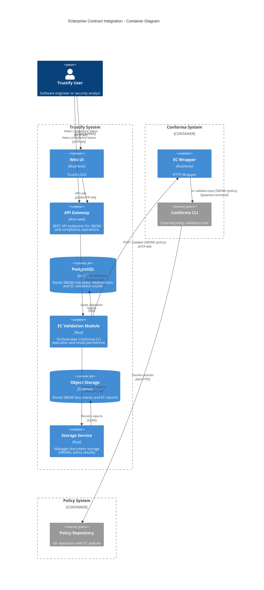
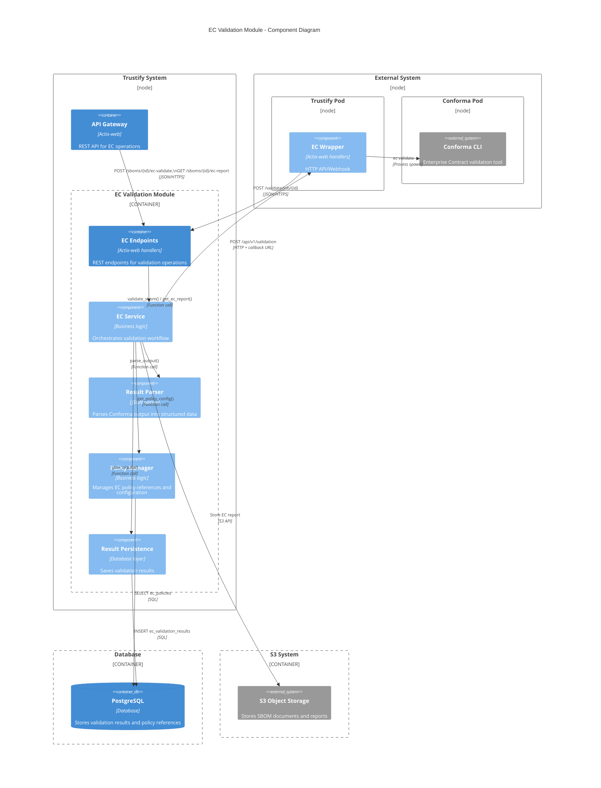
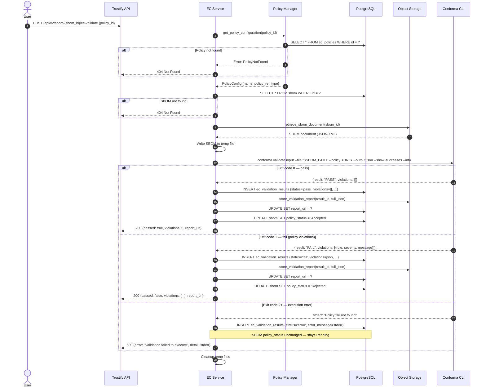

# 00014. Enterprise Contract Integration

Date: 2026-02-03

## Status

PROPOSED

## Context

Trustify provides SBOM storage, analysis, and vulnerability tracking but lacks automated policy enforcement. Organizations need to validate SBOMs against security and compliance policies (licensing, vulnerabilities, provenance) without relying on manual, inconsistent review processes.

Enterprise Contract (Conforma) is an open-source policy enforcement tool actively maintained by Red Hat. It validates SBOMs against configurable policies and produces structured JSON output. Currently it provides only a CLI; a REST API is planned but with no committed timeline.

### Requirements

Users need the ability to:

1. Validate SBOMs against organizational policies
2. Define and manage multiple policy configurations
3. View compliance status and violation details for each SBOM
4. Track compliance history over time
5. Generate detailed compliance reports for auditing
6. Receive actionable feedback on policy violations

## Decision

We will integrate Conforma into Trustify as a user triggered validation service by interacting with Conforma CLI.  
Validation is manually triggered — not automatic on SBOM upload.  
Validation on upload is deferred to a follow-up version.

Conforma CLI is deployed separately from Trustify as either a standalone container or equivalent.
A HTTP wrapper will act as a proxy between Trustify EC service and Conforma CLI.

Uploaded SBOMs start in "Pending" status and are not discoverable until validated. EC validation is one mechanism by which an SBOM can move from "Pending" to "Accepted" or "Rejected":

- An SBOM in "Pending" can be submitted for EC validation.
- A passing EC result transitions the SBOM to "Accepted".
- A failing EC result transitions it to "Rejected", with the violation details linked.
- An EC execution error (CLI crash, policy fetch failure) does not change the SBOM's policy status — the SBOM stays Pending and the error is surfaced separately, so it doesn't silently block an SBOM.

What is stored where

- PostgreSQL: validation status, structured violations (JSONB), summary statistics, foreign keys to SBOM and policy. Indexed on sbom_id, status, executed_at.
- S3/Minio: full raw Conforma JSON report, linked from the DB row via report_url. Keeps DB rows small while preserving audit completeness.
- Not stored: the policy definitions themselves. ec_policies stores references (URLs, OCI refs) that Conforma fetches at runtime.

Storing full JSON in S3 rather than only a summary was chosen explicitly to preserve audit completeness — callers can always fetch the raw report. The DB violations JSONB holds enough structure for filtering and dashboards without duplicating the full payload.

## Consequences

Using a HTTP API wrapper decouples the validation process into a external service.
This will better catter for large-scale deployments as EC validation has its own constraint.
Meanwhile it adds infrastructure complexity as the Webhook will need to be deployed alongside the EC system

Integrating via CLI spawning rather than a native API introduces an external process dependency that adds operational overhead (Conforma must be installed and version-pinned on every server) and per-validation process spawning overhead. These are accepted trade-offs given that no Conforma API exists yet. The executor is built behind an adapter interface so the implementation can be swapped for a REST client in Phase 3 without changes to the service layer or API.

### Alternatives Considered

#### In-Process Policy Engine: Rejected

Reimplementing Enterprise Contract logic in Rust would diverge from upstream and create significant maintenance burden.

#### Direct Integration: Rejected

Couple validation integrated within Trustify service through a directly controlled component was simpler but worse for large-scale deployments.

#### Embedded WASM Module: Rejected

Conforma is not available as WASM and would require major upstream changes.

#### Batch Processing Queue: Deferred

A Redis/RabbitMQ queue would improve retry handling and priority management; implement if the 429-based rejection approach proves insufficient under real load.

### Future API Migration

When Conforma provides a REST API, the executor.rs adapter is replaced with an HTTP client. A feature flag (ec-api-mode) allows gradual migration. No changes to service layer, API endpoints, or UI are required.

## The solution

### System Architecture


### Component Diagram - EC Validation Module



### Container Diagram



### The main sequence Diagram



### The Data Model

**`ec_policy`** - Stores references to external policies, not the policies themselves

- `id` (UUID, PK)
- `name` (VARCHAR, unique) - User-friendly name label
- `description` (TEXT) - What this policy enforces
- `policy_ref` (VARCHAR) - Git URL, OCI registry, or file path
- `policy_type` (VARCHAR) - 'git', 'oci', 'local'
- `configuration` (JSONB) - Branch, tag, auth credentials, etc.
- `created_at`, `updated_at` (TIMESTAMP)

**`ec_validation_results`** - one row per validation execution

- `id` (UUID, PK)
- `sbom_id` (UUID, FK → sbom)
- `policy_id` (UUID, FK → ec_policies)
- `status` (VARCHAR) - 'pass', 'fail', 'error'
- `violations` (JSONB) - Structured violation data for querying
- `summary` (JSONB) - Total checks, passed, failed, warnings
- `report_url` (VARCHAR) - S3 URL to detailed report
- `executed_at` (TIMESTAMP)
- `execution_duration_ms` (INTEGER)
- `conforma_version` (VARCHAR) - For reproducibility
- `error_message` (TEXT) - Populated only on error status

### API Endpoints

```
POST   /api/v2/sboms/{id}/ec-validate         # Trigger validation
GET    /api/v2/sboms/{id}/ec-report           # Get latest validation result
GET    /api/v2/sboms/{id}/ec-report/history   # Get validation history
GET    /api/v2/ec/report/{result_id}          # Download detailed report from S3

POST   /api/v2/ec/policies                    # Create policy reference (admin)
GET    /api/v2/ec/policies                    # List policy references
GET    /api/v2/ec/policies/{id}               # Get policy reference
PUT    /api/v2/ec/policies/{id}               # Update policy reference (admin)
DELETE /api/v2/ec/policies/{id}               # Delete policy reference (admin)
```

### Technical Considerations

#### Conforma CLI Execution

Conforma is invoked via tokio::process::Command to avoid blocking the async runtime. All arguments are passed as an array — never as a shell string — to prevent CLI injection. Execution has a configurable timeout (default 5 minutes); large SBOMs are streamed to a temp file and passed by path rather than piped via stdin, which avoids OOM issues with the parent process.

Exit codes are treated as follows: 0 = pass, 1 = policy violations (expected failure, not an error), 2+ = execution error. It is important to distinguish 1 from 2+ in error handling — a policy violation is a valid result that should be surfaced to the user, not treated as a system failure.

Temp files (SBOM, any cached policy material) are cleaned up in a finally-equivalent block regardless of execution outcome, including on timeout.

#### Concurrency and Backpressure

Concurrent Conforma processes are bounded by a semaphore (default: 5). When the semaphore is exhausted, incoming validation requests return 429 Too Many Requests immediately rather than queuing or blocking indefinitely. This makes the capacity limit explicit to callers (e.g. CI pipelines can implement their own retry with backoff). If demand grows to warrant it, a proper queue (Redis/RabbitMQ) is the deferred alternative considered below.

#### Policy Management

ec_policies stores external references only. Conforma fetches the actual policy at validation time, which means Trustify does not cache policy content by default. The trade-off: validation always uses the latest policy version, but network failures or policy repo outages will cause execution errors. For private policy repositories, authentication credentials are stored in the configuration JSONB column and must be encrypted at rest; they are never logged.

Policy version/commit hash is recorded in the conforma_version field of each result row, enabling reproducibility and audit.

#### Multi-tenancy

Policy references are global (shared across all users) in this initial implementation. Per-organization policy namespacing is out of scope here and should be addressed in a dedicated multi-tenancy ADR when Trustify adds org-level isolation more broadly.

### Module Structure

```
modules/ec/
├── Cargo.toml
└── src/
    ├── lib.rs
    ├── endpoints/
    │   └── mod.rs              # REST endpoints
    ├── model/
    │   ├── mod.rs
    │   ├── policy.rs           # Policy API models
    │   └── validation.rs       # Validation result models
    ├── service/
    │   ├── mod.rs
    │   ├── ec_service.rs       # Main orchestration
    │   ├── policy_manager.rs   # Policy configuration
    │   ├── executor.rs         # Conforma CLI execution
    │   └── result_parser.rs    # Output parsing
    └── error.rs                # Error types
```

### References

- [Enterprise Contract (Conforma) GitHub](https://github.com/enterprise-contract/ec-cli)
- [Design Document](../design/enterprise-contract-integration.md)
- [ADR-00005: Upload API for UI](./00005-ui-upload.md) - Similar async processing pattern
- [ADR-00001: Graph Analytics](./00001-graph-analytics.md) - Database query patterns
