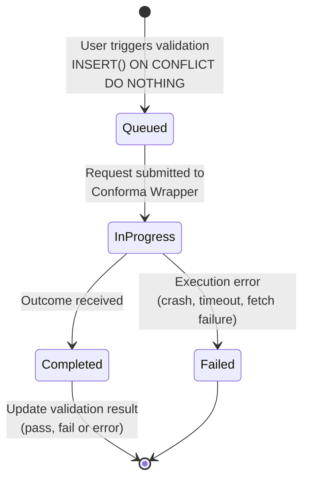
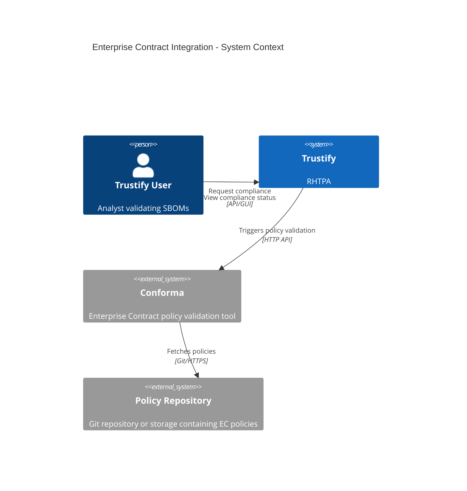
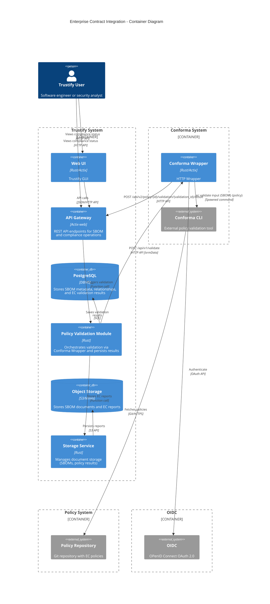
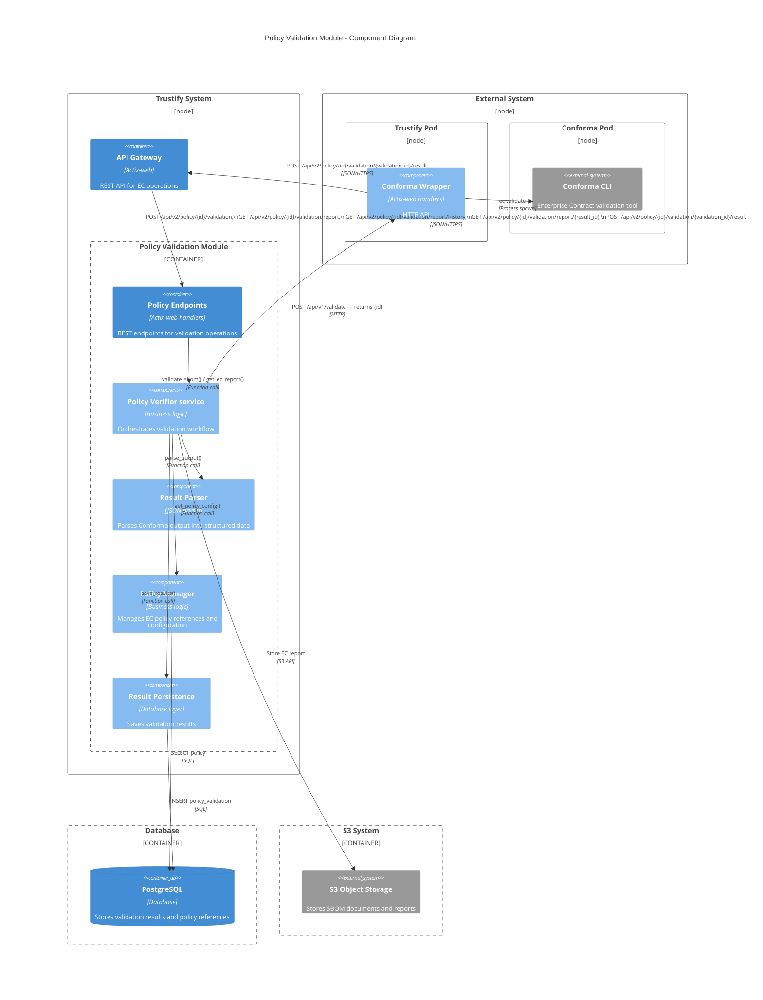
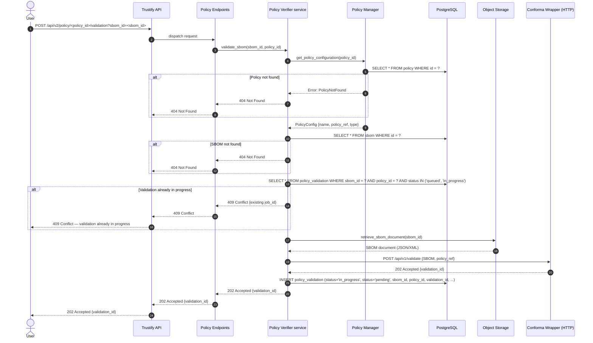
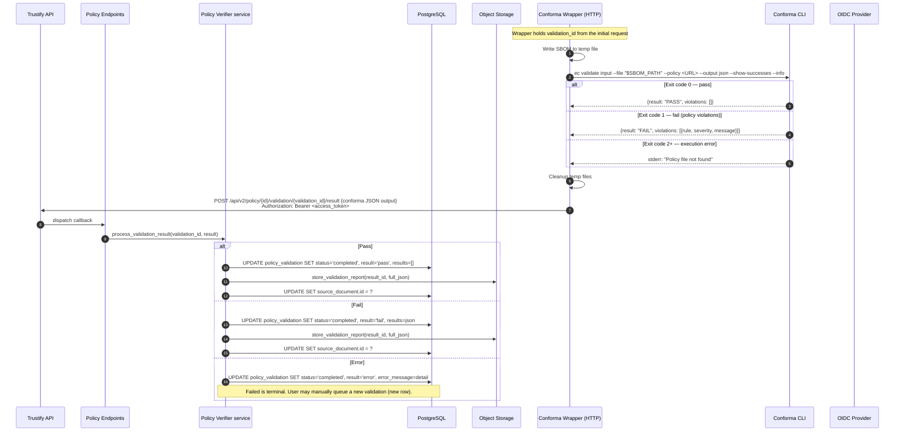

# 00014. Enterprise Contract Integration

Date: 2026-02-03

## Status

APPROVED

## Context

Trustify provides SBOM storage, analysis, and vulnerability tracking but lacks automated policy enforcement. Organizations need to validate SBOMs against security and compliance policies (licensing, vulnerabilities, provenance) without relying on manual, inconsistent review processes.

Conforma (former Enterprise Contract) is an open-source policy enforcement tool actively maintained by Red Hat. It validates SBOMs against configurable policies and produces structured JSON output. Currently it provides only a CLI; a REST API is planned but with no committed timeline.

### Requirements

Users need the ability to:

1. Validate SBOMs against organizational policies
2. Define and manage multiple policy configurations
3. View compliance status and violation details for each SBOM
4. Track compliance history over time
5. Generate detailed compliance reports for auditing
6. Receive actionable feedback on policy violations

## Decision

We will integrate Conforma into Trustify as a user triggered validation service by interacting with Conforma CLI.  
Validation is manually triggered — not automatic on SBOM upload.  
Trustify stores information to identify (id, name, URL) of Policies.

Conforma CLI is deployed separately from Trustify as either a standalone container or equivalent.

A Conforma Wrapper (HTTP service) will act as a proxy between Trustify's Policy Verifier service and Conforma CLI.

### The Conforma HTTP Wrapper

Policy validation can be be very resource-intensive, especially for large SBOMs with thousands of packages, and it requires a dedicated environment and having the Conforma HTTP Wrapper running alongside the Conforma CLI provides :

- **Resource isolation** — A long-running or memory-heavy Conforma process cannot degrade Trustify's responsiveness.
- **Independent scaling** — The Conforma Wrapper can be scaled horizontally (more replicas) based on validation demand without scaling the entire Trustify deployment. Conversely, Trustify can scale for query load without provisioning excess capacity for validation.
- **Failure containment** — An Conforma CLI crash (OOM kill, policy fetch timeout, unexpected CLI error) is isolated to the wrapper which will propagate back to Trustify the failure; This is a terminal state where the user will need to queue a new validation. In case the wrapper crashed, a timeout period will force Trustify to change the state of the queued validations to "Failed".
- **Version independence** — The Conforma Wrapper and Conforma CLI can be upgraded or rolled back on their own release cadence, without redeploying Trustify. This is important given Conforma's active development pace.

### Validation process state

Each SBOM + policy pair has two validation states

The validation process state of the

To track the progress of the external validation process through the Conforma HTTP Wrapper, the following states are used :

- **Queued** — a user has triggered validation; the request is being processed. Other users can see this state, preventing duplicate validation runs for the same SBOM + policy pair.
- **In Progress** — the request has been submitted to Conforma Wrapper.
- **Completed** — the outcome of the request has been received back from Conforma Wrapper.
- **Failed** — an execution error occurred (CLI crash, policy fetch failure, timeout). This is a terminal state; the error is surfaced to the user, who may manually queue a new validation run.



The result of a Policy validation is updated only when the validation process is completed.

### What is stored where

- PostgreSQL: validation process state (`status`), validation outcome (`status`), structured results (JSONB), summary statistics, foreign keys to SBOM and policy. Indexed on sbom_id, status.
- Storage system: full raw Conforma JSON report, linked from the DB row via `source_document.id`. Keeps DB rows small while preserving audit completeness.
- Not stored: the policy definitions themselves. policy stores references (URLs, OCI refs) that Conforma fetches at runtime.

Storing full JSON in storage system rather than only a summary was chosen explicitly to preserve audit completeness — callers can always fetch the raw report. The DB results JSONB holds enough structure for filtering and dashboards without duplicating the full payload.

## Consequences

### Conforma HTTP Wrapper

It's deployed separatly alongside the Conforma CLI instance, monitored, and maintained as a separate component.

In Kubernetes or standalone machine deployments, the Conforma Wrapper pod has its own resource requests/limits, independent of the Trustify pod.

### CLI spawning

Within the Conforma Wrapper, Conforma is invoked via CLI spawning rather than a native API. This introduces an operational dependency (Conforma must be installed and version-pinned on every Conforma Wrapper instance) and per-validation process spawning overhead. These are accepted trade-offs given that no Conforma REST API exists yet. On the Trustify side, the Policy Verifier service interacts with the Conforma Wrapper over HTTP and is built behind an adapter interface, so the implementation can be swapped for a direct Conforma REST client when one becomes available, without changes to the service layer or API.

### Alternatives Considered

#### In-Process Policy Engine: Rejected

Reimplementing Enterprise Contract logic in Rust would diverge from upstream and create significant maintenance burden.

#### Direct Integration: Rejected

Couple validation integrated within Trustify service through a directly controlled component was simpler but worse for large-scale deployments.

#### Embedded WASM Module: Rejected

Conforma is not available as WASM and would require major upstream changes.

#### Batch Processing Queue: Deferred

A Redis/RabbitMQ queue would improve retry handling and priority management; implement if the 429-based rejection approach proves insufficient under real load.

## Details

### System Architecture



### Container Diagram - Policy Validation Module



### Component Diagram



### Sequence Diagram — User Request (synchronous)



### Sequence Diagram — Async Validation Processing



### The Data Model

**`policy`** - Stores references to external policies, not the policies themselves

- `id` (UUID, PK)
- `name` (VARCHAR, unique) - User-friendly name label
- `description` (TEXT) - What this policy enforces
- `policy_type` (ENUM) - 'Conforma'
- `configuration` (JSONB) - See model below
- `revision`(UUID) - Conditional UPDATE filtering both the primary key and the current revision

**`policy.configuration` JSONB model:**

| Field                  | Type     | Required        | Description                                                                                           |
| ---------------------- | -------- | --------------- | ----------------------------------------------------------------------------------------------------- |
| `policy_ref`           | string   | yes             | Policy source URL, e.g. `"git://[URL]?ref=[BRANCH OR TAG]"`                                           |
| `auth`                 | object   | no              | Credentials for private repos; sensitive values encrypted via `ring::aead` AES-256-GCM (never logged) |
| `auth.type`            | string   | yes (if `auth`) | `"token"`, `"ssh_key"`, or `"none"`                                                                   |
| `auth.token_encrypted` | string   | no              | AES-256-GCM encrypted bearer/PAT token, prefixed with encryption scheme                               |
| `policy_paths`         | string[] | no              | Sub-paths within the repo to evaluate (maps to Conforma `--policy` source paths)                      |
| `exclude`              | string[] | no              | Rule codes to skip during validation                                                                  |
| `include`              | string[] | no              | If non-empty, only these rule codes are evaluated                                                     |
| `timeout_seconds`      | integer  | no              | Per-policy override of the default 5-minute execution timeout                                         |
| `extra_args`           | string[] | no              | Additional CLI flags forwarded verbatim to Conforma                                                   |

`policy.configuration` example :

```json
{
  "policy_ref": "git://github.com/org/policy-repo?ref=main",
  "auth": {
    "type": "token",
    "token_encrypted": "AES-256-GCM:<base64-nonce>:<base64-ciphertext>"
  },
  "policy_paths": ["policy/lib", "policy/release"],
  "exclude": ["hello_world.minimal_packages"],
  "include": [],
  "timeout_seconds": 300,
  "extra_args": ["--strict"]
}
```

**`policy_validation`** - one row per validation execution

- `id` (UUID, PK)
- `sbom_id` (UUID, FK → sbom)
- `policy_id` (UUID, FK → policy)
- `status` (ENUM) - 'null', 'queued', 'in_progress', 'completed', 'failed'
- `error`(TEXT) - Error message
- `result` (ENUM) - 'null', 'fail', 'pass' or 'error'
- `results` (JSONB) - See model below
- `success` (BOOL) - Overall pass/fail outcome (mirrors Conforma's top-level `success` field)
- `total` (NUMBER) - Total number of checks evaluated
- `violations`(NUMBER) - Count of checks with violation severity
- `warnings` (NUMBER) - Count of checks with warning severity
- `successes` (NUMBER) - Count of checks that passed
- `type_metadata` (JSONB) - Policy validator specific data
- `validation_time` (DATETIME) - Evaluation duration
- `source_document_id` (VARCHAR) - File system or S3 id of the detailed report
- `error_message` (TEXT) - Populated only on error status

**`policy_validation.results` JSONB model:**

| Field                  | Type   | Required | Description                                             |
| ---------------------- | ------ | -------- | ------------------------------------------------------- |
| `severity`             | string | yes      | `"violation"`, `"warning"`, or `"success"`              |
| `msg`                  | string | yes      | Human-readable message describing the check outcome     |
| `metadata`             | object | yes      | Rule metadata, preserved as-is from Conforma CLI output |
| `metadata.code`        | string | yes      | Rule identifier for filtering and deduplication         |
| `metadata.title`       | string | yes      | Short rule title                                        |
| `metadata.description` | string | no       | Detailed explanation of what the rule checks            |
| `metadata.solution`    | string | no       | Suggested remediation (absent for successes)            |

`policy_validation.results` example:

```json
[
  {
    "severity": "violation",
    "msg": "There are 2942 packages which is more than the permitted maximum of 510.",
    "metadata": {
      "code": "hello_world.minimal_packages",
      "title": "Check we don't have too many packages",
      "description": "Just an example... To exclude this rule add \"hello_world.minimal_packages\" to the `exclude` section of the policy configuration.",
      "solution": "You need to reduce the number of dependencies in this artifact."
    }
  },
  {
    "severity": "warning",
    "msg": "Deprecated license format detected.",
    "metadata": {
      "code": "license.format_check",
      "title": "License format validation",
      "description": "Checks that license identifiers follow the SPDX specification.",
      "solution": "Update license identifiers to valid SPDX expressions."
    }
  },
  {
    "severity": "success",
    "msg": "Pass",
    "metadata": {
      "code": "hello_world.valid_spdxid",
      "title": "Check for valid SPDXID value",
      "description": "Make sure that the SPDXID value found in the SBOM matches a list of allowed values."
    }
  }
]
```

**`policy_validation.type_metadata` JSONB model in the Conforma case:**

| Field              | Type   | Required | Description                                |
| ------------------ | ------ | -------- | ------------------------------------------ |
| `conforma_version` | string | yes      | Version of Conforma CLI (e.g. `"v0.8.83"`) |

`policy_validation.type_metadata` example:

```json
{
  "conforma_version": "v0.8.83"
}
```

#### Data Model Implementation

```rust
enum ValidatorKind {
    Null,
    Conforma,
}
```

```rust
/// The policy reference information
#[derive(Serialize, Deserialize)]
struct Policy {
    id: String,
    name: String,
    #[serde(default, skip_serializing_if = "Option::is_none")]
    description: Option<String>,
    policy_type: ValidatorKind,
    configuration: serde_json::Value,
    /// Conditional updates compare this revision (also exposed as `ETag` on GET).
    revision: Uuid,
}
```

```rust
/// Policy information that can be mutated
#[derive(Serialize, Deserialize)]
struct PolicyRequest {
    name: String,
    #[serde(default, skip_serializing_if = "Option::is_none")]
    description: Option<String>,
    policy_type: ValidatorKind,
    configuration: serde_json::Value,
}
```

```rust
/// Credentials for private policy repos (`policy.configuration.auth`)
#[derive(Serialize, Deserialize)]
struct PolicyAuth {
    /// `"token"`, `"ssh_key"`, or `"none"`
    #[serde(rename = "type")]
    auth_type: String,
    #[serde(default, skip_serializing_if = "Option::is_none")]
    token_encrypted: Option<String>,
}
```

```rust
/// Policy configuration (stored as JSONB)
#[derive(Serialize, Deserialize)]
struct PolicyConfiguration {
    policy_ref: String,
    #[serde(default, skip_serializing_if = "Option::is_none")]
    auth: Option<PolicyAuth>,
    #[serde(default, skip_serializing_if = "Vec::is_empty")]
    policy_paths: Vec<String>,
    #[serde(default, skip_serializing_if = "Vec::is_empty")]
    exclude: Vec<String>,
    #[serde(default, skip_serializing_if = "Vec::is_empty")]
    include: Vec<String>,
    #[serde(default, skip_serializing_if = "Option::is_none")]
    timeout_seconds: Option<u32>,
    #[serde(default, skip_serializing_if = "Vec::is_empty")]
    extra_args: Vec<String>,
}
```

```rust
/// Conforma-specific `policy_validation.type_metadata`
#[derive(Serialize, Deserialize)]
struct ConformaTypeMetadata {
    conforma_version: String,
}
```

```rust
/// One row per validation execution (`policy_validation`)
#[derive(Serialize, Deserialize)]
struct PolicyValidation {
    id: String,
    sbom_id: String,
    policy_id: String,
    /// Lifecycle: `'null'`, `'queued'`, `'in_progress'`, `'completed'`, `'failed'`
    status: String,
    #[serde(default, skip_serializing_if = "Option::is_none")]
    error: Option<String>,
    /// Present once `status` is `'completed'` or `'failed'`
    #[serde(default, skip_serializing_if = "Option::is_none")]
    outcome: Option<ValidationOutcome>,
}
```

```rust
/// Outcome produced when a validation finishes (all-or-nothing)
#[derive(Serialize, Deserialize)]
struct ValidationOutcome {
    /// `'fail'`, `'pass'`, `'error'`
    result: String,
    results: Vec<PolicyValidationResult>,
    success: bool,
    total: u32,
    violations: u32,
    warnings: u32,
    successes: u32,
    #[serde(default, skip_serializing_if = "Option::is_none")]
    type_metadata: Option<ConformaTypeMetadata>,
    validation_time: String,
    #[serde(default, skip_serializing_if = "Option::is_none")]
    source_document_id: Option<String>,
    #[serde(default, skip_serializing_if = "Option::is_none")]
    error_message: Option<String>,
}
```

```rust
/// A single check result within `policy_validation.results`
#[derive(Serialize, Deserialize)]
#[serde(tag = "severity")]
enum PolicyValidationResult {
    #[serde(rename = "violation")]
    Violation {
        msg: String,
        metadata: PolicyValidationResultMetadata,
    },
    #[serde(rename = "warning")]
    Warning {
        msg: String,
        metadata: PolicyValidationResultMetadata,
    },
    #[serde(rename = "success")]
    Success {
        msg: String,
        metadata: PolicyValidationResultMetadata,
    },
}
```

```rust
#[derive(Serialize, Deserialize)]
struct PolicyValidationResultMetadata {
    code: String,
    title: String,
    #[serde(default, skip_serializing_if = "Option::is_none")]
    description: Option<String>,
    #[serde(default, skip_serializing_if = "Option::is_none")]
    solution: Option<String>,
}
```

## Trustify API Endpoints

```
POST   /api/v2/policy                                                  # Create a new policy reference
GET    /api/v2/policy                                                  # List policy references
GET    /api/v2/policy/{id}                                             # Get a single policy reference
PUT    /api/v2/policy/{id}                                             # Update a policy reference
DELETE /api/v2/policy/{id}                                             # Delete a policy reference
POST   /api/v2/policy/{id}/validation                                  # Trigger policy validation
GET    /api/v2/policy/{id}/validation/report                           # Get latest validation result
GET    /api/v2/policy/{id}/validation/report/history                   # Get validation history
GET    /api/v2/policy/{id}/validation/report/{result_id}               # Download full report
POST   /api/v2/policy/{id}/validation/{validation_id}/result           # Callback for validation result
```

### Permissions

The policy module introduces the following permissions, following the existing Trustify CRUD convention:

| Permission      | Description                                                        |
| --------------- | ------------------------------------------------------------------ |
| `create.policy` | Create policy references and trigger validations                   |
| `read.policy`   | List/get policy references and read validation results and reports |
| `update.policy` | Update policy references and post validation results (callback)    |
| `delete.policy` | Delete policy references                                           |

These permissions map to the default OIDC scope groups:

| Scope             | Permissions granted |
| ----------------- | ------------------- |
| `create:document` | `create.policy`     |
| `read:document`   | `read.policy`       |
| `update:document` | `update.policy`     |
| `delete:document` | `delete.policy`     |

Endpoint permission requirements:

| Endpoint                                                     | Permission      |
| ------------------------------------------------------------ | --------------- |
| `POST /api/v2/policy`                                        | `create.policy` |
| `GET /api/v2/policy`                                         | `read.policy`   |
| `GET /api/v2/policy/{id}`                                    | `read.policy`   |
| `PUT /api/v2/policy/{id}`                                    | `update.policy` |
| `DELETE /api/v2/policy/{id}`                                 | `delete.policy` |
| `POST /api/v2/policy/{id}/validation`                        | `create.policy` |
| `GET /api/v2/policy/{id}/validation/report`                  | `read.policy`   |
| `GET /api/v2/policy/{id}/validation/report/history`          | `read.policy`   |
| `GET /api/v2/policy/{id}/validation/report/{result_id}`      | `read.policy`   |
| `POST /api/v2/policy/{id}/validation/{validation_id}/result` | `update.policy` |

The Conforma Wrapper's OIDC client (see [Conforma Wrapper OIDC Configuration](#conforma-wrapper-oidc-configuration)) should be registered with the minimal scope required — only `update:document` (granting `update.policy`) — so it can post results to the callback endpoint.

### POST `/api/v2/policy`

Create a new policy reference.

#### Request

| part | name | type            | description |
| ---- | ---- | --------------- | ----------- |
| body | -    | `PolicyRequest` |             |

#### Response

- 201 - the policy was created

  ```yaml
  id: <id> # ID of the created policy
  ```

  And:

  ```
  Location: /api/v2/policy/<id>
  ```

- 400 - if the request could not be understood
- 401 - if the user was not authenticated
- 403 - if the user was authenticated but not authorized
- 409 - if a policy with the same name already exists

### GET `/api/v2/policy`

List policy references, optionally filtered.

By default, the entries will be sorted by name ascending.

#### Request

| part  | name     | type       | description                                             |
| ----- | -------- | ---------- | ------------------------------------------------------- |
| query | `q`      | "q" string | "q style" query string                                  |
| query | `limit`  | u64        | Maximum number of items to return                       |
| query | `offset` | u64        | Initial items to skip before actually returning results |

The following `q` parameters are supported:

- `name`: Filters policies by their name.

#### Response

- 200 - if the user is allowed to read policies

  ```rust
  #[derive(Serialize, Deserialize)]
  struct PaginatedPolicy {
      total: u64,
      items: Vec<Policy>,
  }
  ```

- 401 - if the user was not authenticated
- 403 - if the user was authenticated but not authorized

### GET `/api/v2/policy/{id}`

Get a single policy reference by ID.

#### Request

| part | name | type     | description             |
| ---- | ---- | -------- | ----------------------- |
| path | `id` | `String` | ID of the policy to get |

#### Response

- 200 - if the policy was found

  | part    | name   | type     | description                        |
  | ------- | ------ | -------- | ---------------------------------- |
  | body    | -      | `Policy` | The policy information             |
  | headers | `ETag` | string   | Value which indicates the revision |

- 401 - if the user was not authenticated
- 404 - if the policy was not found or the user doesn't have permission to read this policy

### PUT `/api/v2/policy/{id}`

Update an existing policy reference.

#### Request

| part   | name      | type             | description                    |
| ------ | --------- | ---------------- | ------------------------------ |
| path   | `id`      | `String`         | ID of the policy to update     |
| header | `IfMatch` | `Option<String>` | ETag value, revision to update |
| body   | -         | `PolicyRequest`  | The new content                |

#### Response

- 204 - the policy was updated
- 400 - if the request could not be understood
- 401 - if the user was not authenticated
- 403 - if the user was authenticated but not authorized
- 404 - if the policy was not found
- 409 - if a policy with the same name already exists
- 412 - if the `IfMatch` header was present, but its value didn't match the stored revision

### DELETE `/api/v2/policy/{id}`

Delete an existing policy reference.

Deleting a policy will fail if there are validation results referencing it.

#### Request

| part   | name      | type             | description                    |
| ------ | --------- | ---------------- | ------------------------------ |
| path   | `id`      | `String`         | ID of the policy to delete     |
| header | `IfMatch` | `Option<String>` | ETag value, revision to delete |

#### Response

- 204 - if the policy was successfully deleted
- 204 - if the policy was already deleted
- 400 - if the request could not be understood
- 401 - if the user was not authenticated
- 403 - if the user was authenticated but not authorized
- 409 - if the policy has associated validation results
- 412 - if the `IfMatch` header was present, but its value didn't match the stored revision

### POST `/api/v2/policy/{id}/validation`

Trigger policy validation for a given SBOM. The validation is performed asynchronously by the Conforma Wrapper; a `validation_id` is returned immediately.

If a validation is already in progress for the same SBOM + policy pair, the request is rejected with 409 Conflict.

#### Request

| part  | name      | type     | description                |
| ----- | --------- | -------- | -------------------------- |
| query | `sbom_id` | `String` | ID of the SBOM to validate |

#### Response

- 202 - the validation was accepted and queued

  ```rust
  #[derive(Serialize, Deserialize)]
  struct ValidationAccepted {
      validation_id: Uuid,
  }
  ```

- 400 - if the request could not be understood
- 401 - if the user was not authenticated
- 403 - if the user was authenticated but not authorized
- 404 - if the SBOM or policy was not found
- 409 - if a validation is already in progress for this SBOM + policy pair
- 429 - if the Conforma Wrapper has reached its concurrency limit

### GET `/api/v2/policy/{id}/validation/report`

Get the latest validation result for a given SBOM.

#### Request

| part  | name      | type     | description    |
| ----- | --------- | -------- | -------------- |
| query | `sbom_id` | `String` | ID of the SBOM |

#### Response

- 200 - if a validation result exists

  | part | name | type               | description                  |
  | ---- | ---- | ------------------ | ---------------------------- |
  | body | -    | `PolicyValidation` | The latest validation result |

- 401 - if the user was not authenticated
- 403 - if the user was authenticated but not authorized
- 404 - if the SBOM or policy was not found, or no validation has been performed yet

### GET `/api/v2/policy/{id}/validation/report/history`

Get the validation history for a given SBOM (newest first; typically ordered by validation row creation time or id descending).

#### Request

| part  | name      | type       | description                                             |
| ----- | --------- | ---------- | ------------------------------------------------------- |
| query | `sbom_id` | `String`   | ID of the SBOM                                          |
| query | `q`       | "q" string | "q style" query string                                  |
| query | `limit`   | u64        | Maximum number of items to return                       |
| query | `offset`  | u64        | Initial items to skip before actually returning results |

The following `q` parameters are supported:

- `status`: Filters by processing status (`queued`, `in_progress`, `completed`, `failed`).
- `result`: Filters by verification status (`pending`, `pass`, `fail`, `error`).

#### Response

- 200 - if the SBOM and policy exist

  ```rust
  #[derive(Serialize, Deserialize)]
  struct PaginatedPolicyValidation {
      total: u64,
      items: Vec<PolicyValidation>,
  }
  ```

- 401 - if the user was not authenticated
- 403 - if the user was authenticated but not authorized
- 404 - if the SBOM or policy was not found

### GET `/api/v2/policy/{id}/validation/report/{result_id}`

Download the full raw Conforma JSON report from storage.

#### Request

| part | name        | type     | description                          |
| ---- | ----------- | -------- | ------------------------------------ |
| path | `result_id` | `String` | ID of the validation result to fetch |

#### Response

- 200 - if the report was found

  | part    | name           | type     | description                   |
  | ------- | -------------- | -------- | ----------------------------- |
  | body    | -              | raw JSON | The full Conforma JSON report |
  | headers | `Content-Type` | string   | `application/json`            |

- 401 - if the user was not authenticated
- 403 - if the user was authenticated but not authorized
- 404 - if the validation result or report was not found

### POST `/api/v2/policy/{id}/validation/{validation_id}/result`

Callback endpoint used by the Conforma Wrapper to post the validation result back to Trustify after Conforma CLI execution completes.

This endpoint is not intended for end-user use. Because Trustify enforces OAuth 2.0 authentication on all API endpoints, the Conforma Wrapper must present a valid Bearer token obtained via the **OAuth 2.0 Client Credentials Grant** (see [Conforma Wrapper OIDC Configuration](#conforma-wrapper-oidc-configuration) below).

#### Request

| part   | name            | type     | description                                                                            |
| ------ | --------------- | -------- | -------------------------------------------------------------------------------------- |
| path   | `id`            | `String` | Policy id; must match the policy under which the validation was started                |
| path   | `validation_id` | `String` | ID of the validation (returned in the 202 response)                                    |
| header | `Authorization` | `String` | `Bearer <access_token>` — token obtained from the OIDC provider via Client Credentials |
| body   | -               | raw JSON | The raw Conforma CLI JSON output                                                       |

#### Response

- 204 - the result was accepted and persisted
- 400 - if the request could not be understood or the JSON is malformed
- 401 - if the caller was not authenticated (missing or invalid Bearer token)
- 403 - if the caller was not authorized (token lacks required scope/role)
- 404 - if the policy or validation ID was not found, or the validation does not belong to this policy
- 409 - if the validation already has a result (duplicate callback)

## Conforma Wrapper API Endpoints

### POST `/api/v1/validate`

Accept an SBOM document and policy reference, spawn a Conforma CLI validation, and asynchronously post the result back to the Trustify callback endpoint.

Because the Conforma Wrapper is a network-accessible service, it **must authenticate incoming requests** using the same OIDC provider that Trustify uses. Callers must present a valid Bearer token obtained from the shared OIDC provider. The Wrapper validates the token by fetching the provider's JWKS and verifying the signature, expiry, and issuer — exactly the same mechanism Trustify uses for its own endpoints (see `trustify-auth` / `Authenticator`). This ensures that only authorized Trustify instances (or other permitted clients) can trigger validations.

The Conforma Wrapper must also be pre-configured with OIDC client credentials so it can authenticate to Trustify when posting results back (see [Conforma Wrapper OIDC Configuration](#conforma-wrapper-oidc-configuration)).

#### Request

| part      | name            | type     | description                                                                            |
| --------- | --------------- | -------- | -------------------------------------------------------------------------------------- |
| header    | `Authorization` | `String` | `Bearer <access_token>` — token obtained from the shared OIDC provider                 |
| multipart | `sbom`          | file     | The SBOM document to validate (JSON or XML)                                            |
| multipart | `policy_ref`    | `String` | Policy source URL (e.g. `git://github.com/org/policy-repo?ref=main`)                   |
| multipart | `callback_url`  | `String` | Trustify callback URL (`/api/v2/policy/{policy_id}/validation/{validation_id}/result`) |
| multipart | `extra_args`    | `String` | Additional CLI flags forwarded to Conforma (optional, JSON-encoded array)              |

#### Response

- 202 - the validation was accepted and will be processed asynchronously

  ```rust
  #[derive(Serialize, Deserialize)]
  struct WrapperValidationAccepted {
      validation_id: Uuid,
  }
  ```

- 400 - if the request could not be understood or required fields are missing
- 401 - if the caller was not authenticated (missing or invalid Bearer token)
- 403 - if the caller was authenticated but not authorized (token lacks required scope/role)
- 429 - if the concurrency semaphore is exhausted (too many concurrent validations)

## File Structure

```
modules/policy/
├── Cargo.toml
├── src/
│   ├── error.rs                # Error types
│   ├── lib.rs
│   ├── endpoints/
│   │   └── mod.rs              # REST endpoints
│   ├── model/
│   │   ├── mod.rs
│   │   ├── policy.rs           # Policy API models
│   │   └── validation.rs       # Validation result models
│   ├── service/
│   │   ├── mod.rs
│   │   ├── ec_service.rs       # Main orchestration
│   │   ├── policy_manager.rs   # Policy configuration
│   │   └── result_parser.rs    # Output parsing
│   └── client/
│        └── conforma.rs         # Conforma client adapter
modules/conforma_wrapper
├── build.rs
├── Cargo.toml
└── src/
    ├── endpoints/
    │   └── mod.rs          # REST endpoints
    └── lib.rs
```

## Technical Considerations

#### Conforma Wrapper OIDC Configuration

The Conforma Wrapper has two distinct OIDC responsibilities that share the **same OIDC provider** (e.g. the Keycloak realm used by Trustify):

1. **Inbound authentication** — validate Bearer tokens on incoming requests to `/api/v1/validate`, ensuring only authorized callers (Trustify, CI systems, etc.) can trigger validations.
2. **Outbound authentication** — obtain an access token via the Client Credentials Grant to authenticate when posting results back to the Trustify callback endpoint.

Because both directions use the same OIDC provider, the Wrapper only needs a single issuer URL. It fetches the provider's discovery document (`.well-known/openid-configuration`) once at startup to obtain the JWKS URI (for inbound token validation) and the token endpoint (for outbound token acquisition).

Conversely, the **Conforma client adapter** in Trustify (`modules/policy/src/client/conforma.rs`) also acts as a server: it exposes the callback endpoint (`POST /api/v2/policy/{policy_id}/validation/{validation_id}/result`) that receives validation results from the Conforma Wrapper. This endpoint must be protected so that only the Wrapper — authenticated via its Client Credentials token — can post results. Because the callback endpoint is a standard Trustify REST endpoint, it is protected by Trustify's existing OIDC authentication middleware (`trustify-auth` / `Authenticator`), which validates the Bearer token the Wrapper obtained during its outbound token acquisition. The OIDC client registered for the Wrapper must be granted the minimum role or scope required to call this callback (e.g. `policy:write`), and Trustify must reject tokens that lack the necessary permission with 403 Forbidden.

##### Environment Variables

The following environment variables (or equivalent configuration) must be set at deployment time:

| Variable                            | Required | Description                                                                                                                               |
| ----------------------------------- | -------- | ----------------------------------------------------------------------------------------------------------------------------------------- |
| `TRUSTIFY_OIDC_ISSUER_URL`          | yes      | OIDC issuer URL (e.g. `https://keycloak.example.com/realms/trustify`). Used for discovery of JWKS, token endpoint, and issuer validation. |
| `TRUSTIFY_OIDC_CLIENT_ID`           | yes      | Client ID registered in the OIDC provider for the Conforma Wrapper (used for both inbound audience validation and outbound token grant)   |
| `TRUSTIFY_OIDC_CLIENT_SECRET`       | yes      | Client secret for the registered client (used for the outbound Client Credentials Grant)                                                  |
| `TRUSTIFY_OIDC_SCOPE`               | no       | OAuth scope to request on outbound token grants (defaults to provider default; set if Trustify requires a specific scope)                 |
| `TRUSTIFY_OIDC_TLS_INSECURE`        | no       | Disable TLS certificate validation for the OIDC provider (default `false`; only for development)                                          |
| `TRUSTIFY_OIDC_TLS_CA_CERTIFICATES` | no       | Additional CA certificates to trust when communicating with the OIDC provider                                                             |

##### Inbound Token Validation

On startup the Wrapper fetches the JWKS from the OIDC provider's discovery endpoint and caches it. For each incoming request to `/api/v1/validate`:

1. Extract the `Authorization: Bearer <token>` header.
2. Verify the JWT signature against the cached JWKS (refresh on cache miss for key rotation).
3. Validate standard claims: `iss` matches `TRUSTIFY_OIDC_ISSUER_URL`, token is not expired, `aud` or `azp` includes the expected client.
4. On failure return 401 Unauthorized.

This follows the same validation logic that Trustify's own `Authenticator` uses (see `trustify-auth` crate), so the Wrapper can reuse or mirror that implementation.

##### Outbound Token Acquisition

For posting results back to Trustify the Wrapper uses the **OAuth 2.0 Client Credentials Grant**:

**Token lifecycle**: The Wrapper should cache the access token and refresh it proactively before expiry (using the `expires_in` value from the token response). This avoids a token request on every callback and handles clock skew by refreshing with a safety margin (e.g. 30 seconds before expiry).

**Failure handling**: If the token request fails (OIDC provider unreachable, invalid credentials), the Wrapper cannot deliver the callback. The validation remains in `in_progress` state until Trustify's timeout mechanism marks it as `failed` (see below). The Wrapper should log the token acquisition error and may retry with exponential backoff before giving up.

**Trustify timeout mechanism**: A background reaper task runs periodically inside the Policy Verifier service (default interval: 60 seconds). On each tick it queries for `policy_validation` rows whose `status` is `in_progress` and whose `updated_at` timestamp is older than the configured timeout (default: the policy's `timeout_seconds`, falling back to the global default of 5 minutes). Each stale row is transitioned to `status = 'failed'` with an `error` of `"Validation timed out"`. This covers every failure scenario where the Wrapper never delivers a callback — CLI hang, Wrapper crash, network partition, or token acquisition failure. The reaper uses an `UPDATE … WHERE status = 'in_progress' AND updated_at < NOW() - interval` query so it is idempotent and safe to run from multiple Trustify replicas concurrently.

##### Security Considerations

- The client secret must be stored securely (e.g. Kubernetes Secret, vault injection) and never logged.
- The OIDC client registered for the Conforma Wrapper should be a **dedicated confidential client** (e.g. `conforma-wrapper`) in the OIDC provider, separate from clients used by human users or other services. This client should be granted a narrow, purpose-specific scope — `trustify:policy-callback` — that maps to the single permission needed to post validation results to the callback endpoint. Trustify's authorization middleware must enforce this scope on the callback route (`POST /api/v2/policy/{policy_id}/validation/{validation_id}/result`), rejecting tokens that lack it with 403 Forbidden. By using a dedicated client and scope rather than a broad role like `policy:write`, the blast radius of a compromised credential is limited to callback delivery only — the Wrapper cannot read, delete, or otherwise mutate policies or other Trustify resources.
- TLS is required for all OIDC communication (provider discovery, JWKS fetch, token endpoint).
- The Wrapper should reject tokens from unexpected issuers; the `TRUSTIFY_OIDC_ISSUER_URL` acts as an allowlist of exactly one trusted issuer.

#### Conforma CLI Execution

The Conforma Wrapper invokes Conforma CLI via process spawning (e.g., `tokio::process::Command`). All arguments are passed as an array — never as a shell string — to prevent CLI injection. Execution has a configurable timeout (default 5 minutes); SBOMs are written to a temp file and passed by path in order to avoid OOM issues as SBOM can be very large file they shouldn't not be transfered via STDIN stream.

Exit codes are treated as follows: 0 = pass, 1 = policy violations (expected failure, not an error), 2+ = execution error. It is important to distinguish 1 from 2+ in error handling — a policy violation is a valid result that should be surfaced to the user, not treated as a system failure.

#### Concurrency and Backpressure

Concurrency is controlled at two levels:

- **Trustify (duplicate prevention)** — Before forwarding a request to the Conforma Wrapper, the Policy Verifier service checks whether a validation is already queued or in progress for the same SBOM + policy pair. If one exists, the request is rejected with 409 Conflict, preventing duplicate work.
- **Conforma Wrapper (resource protection)** — Concurrent Conforma CLI processes are bounded by a semaphore (default: 5). When the semaphore is exhausted, the Wrapper returns 429 Too Many Requests, which Trustify propagates to the caller. This makes the capacity limit explicit so that callers (e.g., CI pipelines) can implement their own retry with backoff.

If demand grows beyond what the semaphore-based approach can handle, a proper queue (Redis/RabbitMQ) is a deferred alternative (see _Batch Processing Queue_ in Alternatives Considered above).

##### Kubernetes Deployment

When both Trustify and the Conforma Wrapper are deployed on a Kubernetes cluster, native K8s primitives can complement the application-level concurrency controls described above:

- **Readiness and liveness probes** — The Conforma Wrapper exposes two health endpoints that Kubernetes uses to manage pod lifecycle and traffic routing:
  - _Liveness_ (`GET /healthz`) — returns 200 if the process is alive. Kubernetes restarts the pod if this probe fails (e.g. deadlock, unrecoverable panic). The check is lightweight: it confirms the HTTP server loop is responsive and, optionally, that the OIDC JWKS cache is populated.
  - _Readiness_ (`GET /readyz`) — returns 200 when the pod can accept new work, and 503 when it cannot. The readiness check is tied to the concurrency semaphore: when all permits are in use, the endpoint returns 503, signalling Kubernetes to remove the pod from the Service's endpoint list. New requests are then routed only to pods that still have capacity. Once a permit is released, the probe returns 200 and the pod re-enters the rotation. This provides cluster-level backpressure that is transparent to Trustify — the K8s Service load-balances across ready pods automatically, reducing the likelihood of 429 responses reaching the caller. A 429 is still returned as a last resort if a request arrives between a readiness check and semaphore exhaustion.
- **Horizontal Pod Autoscaler (HPA)** — The Wrapper Deployment can be configured with an HPA that scales replicas based on CPU/memory utilization or a custom metric such as the in-flight validation count exposed via a `/metrics` endpoint. Because the readiness probe already removes saturated pods from the Service, the HPA's scaling decisions and the readiness-driven traffic shifting work together: the HPA adds capacity while readiness prevents overload on existing pods. This allows the cluster to absorb demand spikes without requiring a centralized queue.
- **Resource limits and requests** — Each Wrapper pod should declare CPU and memory `requests` and `limits` that account for the peak resource usage of the CLI subprocess (the semaphore concurrency multiplied by the per-process footprint). This prevents a burst of validations from starving other workloads on the node.
- **NetworkPolicy** — A Kubernetes `NetworkPolicy` can restrict ingress to the Wrapper pods so that only Trustify pods (selected by label) are allowed to reach the `/api/v1/validate` endpoint. This provides a network-layer defense-in-depth on top of the OIDC-based authentication, ensuring that even if a valid token were leaked, it could not be used from outside the trusted namespace.
- **Service discovery** — Trustify references the Wrapper via its Kubernetes `Service` DNS name (e.g. `conforma-wrapper.trustify.svc.cluster.local`). This decouples Trustify from individual pod IPs and lets K8s load-balance requests across ready Wrapper replicas automatically. Combined with the readiness probe, Trustify never needs to be aware of individual pod capacity — the Service only routes to pods that have reported ready.
- **Secrets management** — The OIDC client secret and any policy-repo credentials should be mounted from Kubernetes `Secret` resources (or injected via an external secrets operator such as External Secrets or HashiCorp Vault Agent) rather than embedded in environment variable literals. This integrates with K8s RBAC to limit which pods and service accounts can access the sensitive material.

#### Policy Management

When the policy.policy_type is "Conforma", the initial only policy type supported, the `policy` is using external references only and therefore Trustify does not cache policy content.

Conforma fetches the policy at validation time from the git source specified in `policy.configuration.policy_ref`.

The trade-off: validation always uses the latest policy content from the referenced branch or tag, but network failures or policy repo outages will cause execution errors. For private policy repositories, authentication credentials are stored in the `configuration` JSONB column and encrypted at rest using `ring::aead` (AES-256-GCM authenticated encryption); they are never logged. The `ring` crate is already a direct dependency of the project (used for digest hashing), so no new dependency is required.

The `policy_validation.policy_version` field records the policy commit hash or tag resolved from the `policy_ref` git source at validation time, enabling reproducibility and audit.
`policy_validation.summary.conforma_version`, which tracks the Conforma CLI tool version number (e.g., `v0.8.83`).

## Future Work

#### Validation on SBOM upload

#### Multi-tenancy

Policy references are global (shared across all users) in this initial implementation. Per-organization policy namespacing is out of scope here and should be addressed in a dedicated multi-tenancy ADR when Trustify adds org-level isolation more broadly.

#### Receive actionable feedback on policy violations

This is out of scope of this ADR.

## References

- [Enterprise Contract (Conforma) GitHub](https://github.com/enterprise-contract/ec-cli)
- [Design Document](../design/enterprise-contract-integration.md)
- [ADR-00005: Upload API for UI](./00005-ui-upload.md) - Similar async processing pattern
- [ADR-00001: Graph Analytics](./00001-graph-analytics.md) - Database query patterns
