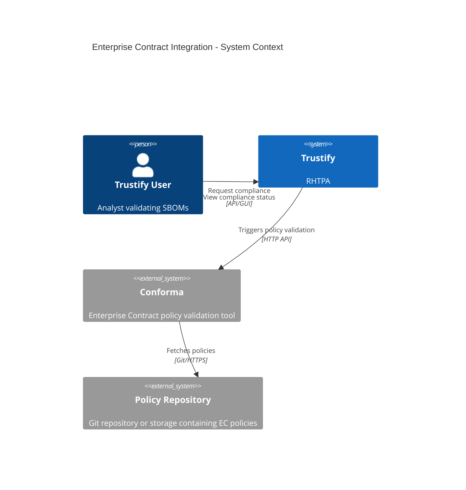
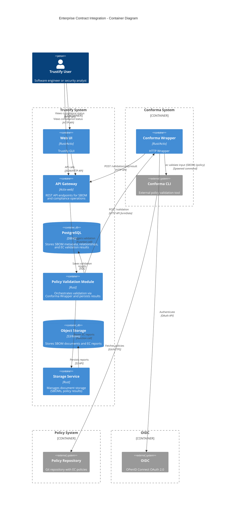
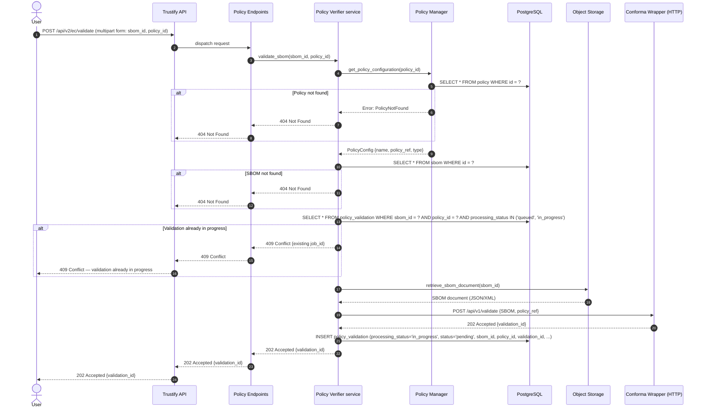
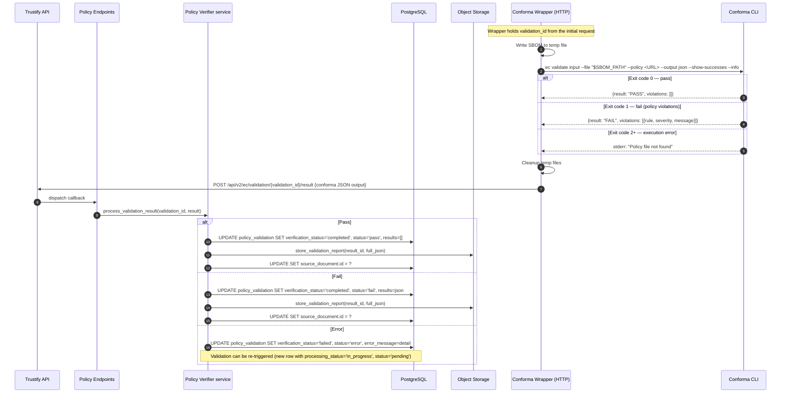

# 00014. Enterprise Contract Integration

Date: 2026-02-03

## Status

APPROVED

## Context

Trustify provides SBOM storage, analysis, and vulnerability tracking but lacks automated policy enforcement. Organizations need to validate SBOMs against security and compliance policies (licensing, vulnerabilities, provenance) without relying on manual, inconsistent review processes.

Conforma (former Enterprise Contract) is an open-source policy enforcement tool actively maintained by Red Hat. It validates SBOMs against configurable policies and produces structured JSON output. Currently it provides only a CLI; a REST API is planned but with no committed timeline.

### Requirements

Users need the ability to:

1. Validate SBOMs against organizational policies
2. Define and manage multiple policy configurations
3. View compliance status and violation details for each SBOM
4. Track compliance history over time
5. Generate detailed compliance reports for auditing
6. Receive actionable feedback on policy violations

## Decision

We will integrate Conforma into Trustify as a user triggered validation service by interacting with Conforma CLI.  
Validation is manually triggered — not automatic on SBOM upload.  
Trustify stores information to identify (id, name, URL) of Policies.
A default Policy is defined at the application level (global policy) which is used for validation when an SBOM does not have any Policy explicitly attached to it.

Conforma CLI is deployed separately from Trustify as either a standalone container or equivalent.
A Conforma Wrapper (HTTP service) acts as a proxy between Trustify's Policy Verifier service and Conforma CLI.

Each SBOM + policy pair has two validation states .

The validation process state of the Conforma Wrapper follows this lifecycle:

- **Queued** — a user has triggered validation; the request is being processed. Other users can see this state, preventing duplicate validation runs for the same SBOM + policy pair.
- **In Progress** — the request has been submitted to Conforma Wrapper.
- **Completed** — the outcome of the request has been received back from Conforma Wrapper.
- **Failed** — an execution error occurred (CLI crash, policy fetch failure, timeout). The error is surfaced separately, and the validation can be re-triggered.

The Policy validation outcome follows this lifecycle:

- **Pending** — initial state, indicates no validation has been triggered yet for this SBOM against this policy.
- **Fail** — Conforma validation found policy violations; violation details are linked.
- **Pass** — Conforma validation succeeded; the SBOM satisfies the policy.
- **Error** — The Conforma validation has generated an error.

The `processing_status` "In Progress" state serves as a concurrency guard: if a validation is already running for a given SBOM + policy pair, subsequent requests are rejected (409 Conflict), preventing duplicate work.

What is stored where

- PostgreSQL: validation process state (`processing_status`), validation outcome (`status`), structured results (JSONB), summary statistics, foreign keys to SBOM and policy. Indexed on sbom_id, processing_status, status, start_time.
- Storage system: full raw Conforma JSON report, linked from the DB row via `source_document.id`. Keeps DB rows small while preserving audit completeness.
- Not stored: the policy definitions themselves. policy stores references (URLs, OCI refs) that Conforma fetches at runtime.

Storing full JSON in storage system rather than only a summary was chosen explicitly to preserve audit completeness — callers can always fetch the raw report. The DB results JSONB holds enough structure for filtering and dashboards without duplicating the full payload.

## Consequences

### The Conforma Wrapper runs externally

EC validation can be be very resource-intensive (especially for large SBOMs with thousands of packages) and it should not compete with Trustify.
A dedicated Conforma Wrapper running alonside EC instance (Conforma CLI, etc) provides :

- **Resource isolation** — A long-running or memory-heavy Conforma process cannot degrade Trustify's responsiveness.
- **Independent scaling** — The Conforma Wrapper can be scaled horizontally (more replicas) based on validation demand without scaling the entire Trustify deployment. Conversely, Trustify can scale for query load without provisioning excess capacity for validation.
- **Failure containment** — An EC instance crash (OOM kill, policy fetch timeout, unexpected CLI error) is isolated to the wrapper. Trustify records the failure in `processing_status` and remains fully operational; the validation can be re-triggered.
- **Version independence** — The Conforma Wrapper and EC instance (Conforma CLI) can be upgraded or rolled back on their own release cadence, without redeploying Trustify. This is important given Conforma's active development pace.

The trade-off is added infrastructure complexity: the Conforma Wrapper must be deployed separatly with EC instance, monitored, and maintained as a separate component alongside the Conforma CLI binary.

In Kubernetes or standalone machine deployments, the Conforma Wrapper pod has its own resource requests/limits, independent of the Trustify pod.

### CLI spawning

Within the Conforma Wrapper, Conforma is invoked via CLI spawning rather than a native API. This introduces an operational dependency (Conforma must be installed and version-pinned on every Conforma Wrapper instance) and per-validation process spawning overhead. These are accepted trade-offs given that no Conforma REST API exists yet. On the Trustify side, the Policy Verifier service interacts with the Conforma Wrapper over HTTP and is built behind an adapter interface, so the implementation can be swapped for a direct Conforma REST client when one becomes available, without changes to the service layer or API.

### Alternatives Considered

#### In-Process Policy Engine: Rejected

Reimplementing Enterprise Contract logic in Rust would diverge from upstream and create significant maintenance burden.

#### Direct Integration: Rejected

Couple validation integrated within Trustify service through a directly controlled component was simpler but worse for large-scale deployments.

#### Embedded WASM Module: Rejected

Conforma is not available as WASM and would require major upstream changes.

#### Batch Processing Queue: Deferred

A Redis/RabbitMQ queue would improve retry handling and priority management; implement if the 429-based rejection approach proves insufficient under real load.

## The solution

### System Architecture



### Container Diagram - Policy Validation Module



### Component Diagram


### Sequence Diagram — User Request (synchronous)



### Sequence Diagram — Async Validation Processing



### The Data Model

**`policy`** - Stores references to external policies, not the policies themselves

- `id` (UUID, PK)
- `name` (VARCHAR, unique) - User-friendly name label
- `description` (TEXT) - What this policy enforces
- `policy_type` (ENUM) - 'Conforma'
- `configuration` (JSONB) - See model below
- `revision`(UUID) - Conditional UPDATE filtering both the primary key and the current revision

**`policy.configuration` JSONB model:**

| Field                  | Type     | Required        | Description                                                                      |
| ---------------------- | -------- | --------------- | -------------------------------------------------------------------------------- |
| `policy_ref`           | string   | yes             | Policy source URL, e.g. `"git://github.com/org/policy-repo?ref=main"`            |
| `auth`                 | object   | no              | Credentials for private repos; sensitive values encrypted via AES (never logged) |
| `auth.type`            | string   | yes (if `auth`) | `"token"`, `"ssh_key"`, or `"none"`                                              |
| `auth.token_encrypted` | string   | no              | AES-encrypted bearer/PAT token, prefixed with encryption scheme                  |
| `policy_paths`         | string[] | no              | Sub-paths within the repo to evaluate (maps to Conforma `--policy` source paths) |
| `exclude`              | string[] | no              | Rule codes to skip during validation                                             |
| `include`              | string[] | no              | If non-empty, only these rule codes are evaluated                                |
| `timeout_seconds`      | integer  | no              | Per-policy override of the default 5-minute execution timeout                    |
| `extra_args`           | string[] | no              | Additional CLI flags forwarded verbatim to Conforma                              |

`policy.configuration` example :

```json
{
  "policy_ref": "git://github.com/org/policy-repo?ref=main",
  "auth": {
    "type": "token",
    "token_encrypted": "AES256:<base64-ciphertext>"
  },
  "policy_paths": ["policy/lib", "policy/release"],
  "exclude": ["hello_world.minimal_packages"],
  "include": [],
  "timeout_seconds": 300,
  "extra_args": ["--strict"]
}
```

**`policy_validation`** - one row per validation execution

- `id` (UUID, PK)
- `sbom_id` (UUID, FK → sbom)
- `policy_id` (UUID, FK → policy)
- `processing_status` (ENUM) - 'queued', 'in_progress', 'completed', 'failed'
- `verification_status` (ENUM) - 'pending', 'pass', 'fail', 'error'
- `results` (JSONB) - See model below
- `success` (BOOLEAN) - Overall pass/fail outcome (mirrors Conforma's top-level `success` field)
- `total` (SMALLINT) - Total number of checks evaluated
- `violations` (SMALLINT) - Count of checks with violation severity
- `warnings` (SMALLINT) - Count of checks with warning severity
- `successes` (SMALLINT) - Count of checks that passed
- `conforma_version`(VARCHAR) - Conforma version used (e.g. `"v0.8.83"`)
- `effective_time` (VARCHAR) - ISO 8601 timestamp of evaluation provided by Conforma
- `source_document_id` (VARCHAR) - File system or S3 path to detailed report
- `start_time` (TIMESTAMP)
- `end_time` (TIMESTAMP)
- `policy_version` (VARCHAR) - Policy commit hash or tag resolved at validation time
- `error_message` (TEXT) - Populated only on error status

**`policy_validation.results` JSONB model:**

| Field                  | Type   | Required | Description                                             |
| ---------------------- | ------ | -------- | ------------------------------------------------------- |
| `severity`             | string | yes      | `"violation"`, `"warning"`, or `"success"`              |
| `msg`                  | string | yes      | Human-readable message describing the check outcome     |
| `metadata`             | object | yes      | Rule metadata, preserved as-is from Conforma CLI output |
| `metadata.code`        | string | yes      | Rule identifier for filtering and deduplication         |
| `metadata.title`       | string | yes      | Short rule title                                        |
| `metadata.description` | string | no       | Detailed explanation of what the rule checks            |
| `metadata.solution`    | string | no       | Suggested remediation (absent for successes)            |

`policy_validation.results` example:

```json
[
  {
    "severity": "violation",
    "msg": "There are 2942 packages which is more than the permitted maximum of 510.",
    "metadata": {
      "code": "hello_world.minimal_packages",
      "title": "Check we don't have too many packages",
      "description": "Just an example... To exclude this rule add \"hello_world.minimal_packages\" to the `exclude` section of the policy configuration.",
      "solution": "You need to reduce the number of dependencies in this artifact."
    }
  },
  {
    "severity": "warning",
    "msg": "Deprecated license format detected.",
    "metadata": {
      "code": "license.format_check",
      "title": "License format validation",
      "description": "Checks that license identifiers follow the SPDX specification.",
      "solution": "Update license identifiers to valid SPDX expressions."
    }
  },
  {
    "severity": "success",
    "msg": "Pass",
    "metadata": {
      "code": "hello_world.valid_spdxid",
      "title": "Check for valid SPDXID value",
      "description": "Make sure that the SPDXID value found in the SBOM matches a list of allowed values."
    }
  }
]
```

**`policy_validation.summary` JSONB model:**

| Field              | Type    | Required | Description                                                              |
| ------------------ | ------- | -------- | ------------------------------------------------------------------------ |
| `success`          | boolean | yes      | Overall pass/fail outcome (mirrors Conforma's top-level `success` field) |
| `total`            | integer | yes      | Total number of checks evaluated                                         |
| `violations`       | integer | yes      | Count of checks with violation severity                                  |
| `warnings`         | integer | yes      | Count of checks with warning severity                                    |
| `successes`        | integer | yes      | Count of checks that passed                                              |
| `conforma_version` | string  | yes      | Conforma version used (e.g. `"v0.8.83"`)                                 |
| `effective_time`   | string  | yes      | ISO 8601 timestamp of evaluation provided by Conforma                    |

`policy_validation.summary` example:

```json
{
  "success": false,
  "total": 3,
  "violations": 1,
  "warnings": 1,
  "successes": 1,
  "conforma_version": "v0.8.83",
  "effective_time": "2026-03-03T14:36:55.807826709Z"
}
```

#### Data Model Implementation

```rust
/// The policy reference information
#[derive(Serialize, Deserialize)]
struct Policy {
    id: Uuid,
    name: String,
    #[serde(default, skip_serializing_if = "Option::is_none")]
    description: Option<String>,
    policy_type: String,
    configuration: PolicyConfiguration,
}
```

```rust
/// Policy information that can be mutated
#[derive(Serialize, Deserialize)]
struct PolicyRequest {
    name: String,
    #[serde(default, skip_serializing_if = "Option::is_none")]
    description: Option<String>,
    policy_type: String,
    configuration: PolicyConfiguration,
}
```

```rust
/// Policy configuration (stored as JSONB)
#[derive(Serialize, Deserialize)]
struct PolicyConfiguration {
    policy_ref: String,
    #[serde(default, skip_serializing_if = "Option::is_none")]
    auth: Option<PolicyAuth>,
    #[serde(default, skip_serializing_if = "Vec::is_empty")]
    policy_paths: Vec<String>,
    #[serde(default, skip_serializing_if = "Vec::is_empty")]
    exclude: Vec<String>,
    #[serde(default, skip_serializing_if = "Vec::is_empty")]
    include: Vec<String>,
    #[serde(default, skip_serializing_if = "Option::is_none")]
    timeout_seconds: Option<u32>,
    #[serde(default, skip_serializing_if = "Vec::is_empty")]
    extra_args: Vec<String>,
}
```

```rust
/// Validation result summary returned by the API
#[derive(Serialize, Deserialize)]
struct PolicyValidation {
    id: Uuid,
    sbom_id: Uuid,
    policy_id: Uuid,
    processing_status: String,
    verification_status: String,
    #[serde(default, skip_serializing_if = "Option::is_none")]
    success: Option<bool>,
    #[serde(default, skip_serializing_if = "Option::is_none")]
    total: Option<u16>,
    #[serde(default, skip_serializing_if = "Option::is_none")]
    violations: Option<u16>,
    #[serde(default, skip_serializing_if = "Option::is_none")]
    warnings: Option<u16>,
    #[serde(default, skip_serializing_if = "Option::is_none")]
    successes: Option<u16>,
    #[serde(default, skip_serializing_if = "Option::is_none")]
    conforma_version: Option<String>,
    #[serde(default, skip_serializing_if = "Option::is_none")]
    effective_time: Option<String>,
    #[serde(default, skip_serializing_if = "Option::is_none")]
    results: Option<Vec<PolicyValidationResult>>,
    #[serde(default, skip_serializing_if = "Option::is_none")]
    source_document_id: Option<String>,
    start_time: String,
    #[serde(default, skip_serializing_if = "Option::is_none")]
    end_time: Option<String>,
    #[serde(default, skip_serializing_if = "Option::is_none")]
    policy_version: Option<String>,
    #[serde(default, skip_serializing_if = "Option::is_none")]
    error_message: Option<String>,
}
```

```rust
/// A single check result within a validation
#[derive(Serialize, Deserialize)]
struct PolicyValidationResult {
    severity: String,
    msg: String,
    metadata: PolicyValidationResultMetadata,
}
```

```rust
#[derive(Serialize, Deserialize)]
struct PolicyValidationResultMetadata {
    code: String,
    title: String,
    #[serde(default, skip_serializing_if = "Option::is_none")]
    description: Option<String>,
    #[serde(default, skip_serializing_if = "Option::is_none")]
    solution: Option<String>,
}
```

### POST `/api/v2/policy`

Create a new policy reference.

#### Request

| part | name | type            | description |
| ---- | ---- | --------------- | ----------- |
| body | -    | `PolicyRequest` |             |

#### Response

- 201 - the policy was created

  ```yaml
  id: <id> # ID of the created policy
  ```

  And:

  ```
  Location: /api/v2/policy/<id>
  ```

- 400 - if the request could not be understood
- 401 - if the user was not authenticated
- 403 - if the user was authenticated but not authorized
- 409 - if a policy with the same name already exists

### GET `/api/v2/policy`

List policy references, optionally filtered.

By default, the entries will be sorted by name ascending.

#### Request

| part  | name     | type       | description                                             |
| ----- | -------- | ---------- | ------------------------------------------------------- |
| query | `q`      | "q" string | "q style" query string                                  |
| query | `limit`  | u64        | Maximum number of items to return                       |
| query | `offset` | u64        | Initial items to skip before actually returning results |

The following `q` parameters are supported:

- `name`: Filters policies by their name.

#### Response

- 200 - if the user is allowed to read policies

  ```rust
  #[derive(Serialize, Deserialize)]
  struct PaginatedPolicy {
      total: u64,
      items: Vec<Policy>,
  }
  ```

- 401 - if the user was not authenticated
- 403 - if the user was authenticated but not authorized

### GET `/api/v2/policy/{id}`

Get a single policy reference by ID.

#### Request

| part | name | type     | description             |
| ---- | ---- | -------- | ----------------------- |
| path | `id` | `String` | ID of the policy to get |

#### Response

- 200 - if the policy was found

  | part    | name   | type     | description                        |
  | ------- | ------ | -------- | ---------------------------------- |
  | body    | -      | `Policy` | The policy information             |
  | headers | `ETag` | string   | Value which indicates the revision |

- 401 - if the user was not authenticated
- 404 - if the policy was not found or the user doesn't have permission to read this policy

### PUT `/api/v2/policy/{id}`

Update an existing policy reference.

#### Request

| part   | name      | type             | description                    |
| ------ | --------- | ---------------- | ------------------------------ |
| path   | `id`      | `String`         | ID of the policy to update     |
| header | `IfMatch` | `Option<String>` | ETag value, revision to update |
| body   | -         | `PolicyRequest`  | The new content                |

#### Response

- 204 - the policy was updated
- 400 - if the request could not be understood
- 401 - if the user was not authenticated
- 403 - if the user was authenticated but not authorized
- 404 - if the policy was not found
- 409 - if a policy with the same name already exists
- 412 - if the `IfMatch` header was present, but its value didn't match the stored revision

### DELETE `/api/v2/policy/{id}`

Delete an existing policy reference.

Deleting a policy will fail if there are validation results referencing it.

#### Request

| part   | name      | type             | description                    |
| ------ | --------- | ---------------- | ------------------------------ |
| path   | `id`      | `String`         | ID of the policy to delete     |
| header | `IfMatch` | `Option<String>` | ETag value, revision to delete |

#### Response

- 204 - if the policy was successfully deleted
- 204 - if the policy was already deleted
- 400 - if the request could not be understood
- 401 - if the user was not authenticated
- 403 - if the user was authenticated but not authorized
- 409 - if the policy has associated validation results
- 412 - if the `IfMatch` header was present, but its value didn't match the stored revision

### POST `/api/v2/policy/validate`

Trigger a policy validation for a given SBOM and policy pair. The validation is performed asynchronously by the Conforma Wrapper; a `validation_id` is returned immediately.

If a validation is already in progress for the same SBOM + policy pair, the request is rejected with 409 Conflict.

#### Request

| part  | name        | type     | description                                                       |
| ----- | ----------- | -------- | ----------------------------------------------------------------- |
| query | `sbom_id`   | `String` | ID of the SBOM to validate                                        |
| query | `policy_id` | `String` | ID of the policy to validate against (omit to use default policy) |

#### Response

- 202 - the validation was accepted and queued

  ```rust
  #[derive(Serialize, Deserialize)]
  struct ValidationAccepted {
      validation_id: Uuid,
  }
  ```

- 400 - if the request could not be understood
- 401 - if the user was not authenticated
- 403 - if the user was authenticated but not authorized
- 404 - if the SBOM or policy was not found
- 409 - if a validation is already in progress for this SBOM + policy pair
- 429 - if the Conforma Wrapper has reached its concurrency limit

### GET `/api/v2/policy/report`

Get the latest validation result for a given SBOM and policy pair.

#### Request

| part  | name        | type     | description                                   |
| ----- | ----------- | -------- | --------------------------------------------- |
| query | `sbom_id`   | `String` | ID of the SBOM                                |
| query | `policy_id` | `String` | ID of the policy (omit to use default policy) |

#### Response

- 200 - if a validation result exists

  | part | name | type               | description                  |
  | ---- | ---- | ------------------ | ---------------------------- |
  | body | -    | `PolicyValidation` | The latest validation result |

- 401 - if the user was not authenticated
- 403 - if the user was authenticated but not authorized
- 404 - if the SBOM or policy was not found, or no validation has been performed yet

### GET `/api/v2/policy/report/history`

Get the validation history for a given SBOM and policy pair, ordered by `start_time` descending.

#### Request

| part  | name        | type       | description                                             |
| ----- | ----------- | ---------- | ------------------------------------------------------- |
| query | `sbom_id`   | `String`   | ID of the SBOM                                          |
| query | `policy_id` | `String`   | ID of the policy (omit to use default policy)           |
| query | `q`         | "q" string | "q style" query string                                  |
| query | `limit`     | u64        | Maximum number of items to return                       |
| query | `offset`    | u64        | Initial items to skip before actually returning results |

The following `q` parameters are supported:

- `processing_status`: Filters by processing status (`queued`, `in_progress`, `completed`, `failed`).
- `verification_status`: Filters by verification status (`pending`, `pass`, `fail`, `error`).

#### Response

- 200 - if the SBOM and policy exist

  ```rust
  #[derive(Serialize, Deserialize)]
  struct PaginatedPolicyValidation {
      total: u64,
      items: Vec<PolicyValidation>,
  }
  ```

- 401 - if the user was not authenticated
- 403 - if the user was authenticated but not authorized
- 404 - if the SBOM or policy was not found

### GET `/api/v2/policy/report/{result_id}`

Download the full raw Conforma JSON report from storage.

#### Request

| part | name        | type     | description                          |
| ---- | ----------- | -------- | ------------------------------------ |
| path | `result_id` | `String` | ID of the validation result to fetch |

#### Response

- 200 - if the report was found

  | part    | name           | type     | description                   |
  | ------- | -------------- | -------- | ----------------------------- |
  | body    | -              | raw JSON | The full Conforma JSON report |
  | headers | `Content-Type` | string   | `application/json`            |

- 401 - if the user was not authenticated
- 403 - if the user was authenticated but not authorized
- 404 - if the validation result or report was not found

### POST `/api/v2/policy/validation/{validation_id}/result`

Callback endpoint used by the Conforma Wrapper to post the validation result back to Trustify after Conforma CLI execution completes.

This endpoint is not intended for end-user use.

#### Request

| part | name            | type     | description                                         |
| ---- | --------------- | -------- | --------------------------------------------------- |
| path | `validation_id` | `String` | ID of the validation (returned in the 202 response) |
| body | -               | raw JSON | The raw Conforma CLI JSON output                    |

#### Response

- 204 - the result was accepted and persisted
- 400 - if the request could not be understood or the JSON is malformed
- 401 - if the caller was not authenticated
- 403 - if the caller was not authorized
- 404 - if the validation ID was not found
- 409 - if the validation already has a result (duplicate callback)

## Conforma Wrapper API Endpoints

```
POST   /api/v1/validate                     # Validate uploaded SBOM file against the provided Policy URL (multipart form)
```

### POST `/api/v1/validate`

Accept an SBOM document and policy reference, spawn a Conforma CLI validation, and asynchronously post the result back to the Trustify callback endpoint.

#### Request

| part      | name           | type     | description                                                                |
| --------- | -------------- | -------- | -------------------------------------------------------------------------- |
| multipart | `sbom`         | file     | The SBOM document to validate (JSON or XML)                                |
| multipart | `policy_ref`   | `String` | Policy source URL (e.g. `git://github.com/org/policy-repo?ref=main`)       |
| multipart | `callback_url` | `String` | Trustify callback URL (`/api/v2/policy/validation/{validation_id}/result`) |
| multipart | `extra_args`   | `String` | Additional CLI flags forwarded to Conforma (optional, JSON-encoded array)  |

#### Response

- 202 - the validation was accepted and will be processed asynchronously

  ```rust
  #[derive(Serialize, Deserialize)]
  struct WrapperValidationAccepted {
      validation_id: Uuid,
  }
  ```

- 400 - if the request could not be understood or required fields are missing
- 401 - if the caller was not authenticated
- 429 - if the concurrency semaphore is exhausted (too many concurrent validations)

### Trustify File Structure

```
modules/policy/
├── Cargo.toml
├── src/
│   ├── error.rs                # Error types
│   ├── lib.rs
│   ├── endpoints/
│   │   └── mod.rs              # REST endpoints
│   ├── model/
│   │   ├── mod.rs
│   │   ├── policy.rs           # Policy API models
│   │   └── validation.rs       # Validation result models
│   ├── service/
│   │   ├── mod.rs
│   │   ├── ec_service.rs       # Main orchestration
│   │   ├── policy_manager.rs   # Policy configuration
│   │   └── result_parser.rs    # Output parsing
│   └── client/
│        └── conforma.rs         # Conforma client adapter
└── conforma_wrapper
    ├── build.rs
    ├── Cargo.toml
    └── src/
        ├── endpoints/
        │   └── mod.rs          # REST endpoints
        └── lib.rs
```

### Technical Considerations

#### Conforma CLI Execution

The Conforma Wrapper invokes Conforma CLI via process spawning (e.g., `tokio::process::Command`). All arguments are passed as an array — never as a shell string — to prevent CLI injection. Execution has a configurable timeout (default 5 minutes); SBOMs are written to a temp file and passed by path in order to avoid OOM issues as SBOM can be very large file they shouldn't not be transfered via STDIN stream.

Exit codes are treated as follows: 0 = pass, 1 = policy violations (expected failure, not an error), 2+ = execution error. It is important to distinguish 1 from 2+ in error handling — a policy violation is a valid result that should be surfaced to the user, not treated as a system failure.

#### Concurrency and Backpressure

On the Conforma Wrapper side, concurrent Conforma processes are bounded by a semaphore (default: 5). When the semaphore is exhausted, the Conforma Wrapper returns 429 Too Many Requests to Trustify, which propagates the status to the caller. This makes the capacity limit explicit to callers (e.g., CI pipelines can implement their own retry with backoff). On the Trustify side, the `processing_status` "In Progress" concurrency guard (409 Conflict) prevents duplicate validation runs for the same SBOM + policy pair. If demand grows to warrant it, a proper queue (Redis/RabbitMQ) is the deferred alternative considered below.

#### Policy Management

`policy` stores external references only as the policy is fetched by Conforma at validation time, therefore Trustify does not cache policy content.

The trade-off: validation always uses the latest policy version, but network failures or policy repo outages will cause execution errors. For private policy repositories, authentication credentials are stored in the configuration JSONB column and will be encrypted using AES crate; they are never logged.

The policy commit hash/tag (`policy_version`) resolved at validation time are recorded in each result row, enabling reproducibility and audit.

### Futur work

#### Validation on SBOM upload

#### Multi-tenancy

Policy references are global (shared across all users) in this initial implementation. Per-organization policy namespacing is out of scope here and should be addressed in a dedicated multi-tenancy ADR when Trustify adds org-level isolation more broadly.

#### Receive actionable feedback on policy violations

This is out of scope of this ADR.

### References

- [Enterprise Contract (Conforma) GitHub](https://github.com/enterprise-contract/ec-cli)
- [Design Document](../design/enterprise-contract-integration.md)
- [ADR-00005: Upload API for UI](./00005-ui-upload.md) - Similar async processing pattern
- [ADR-00001: Graph Analytics](./00001-graph-analytics.md) - Database query patterns
