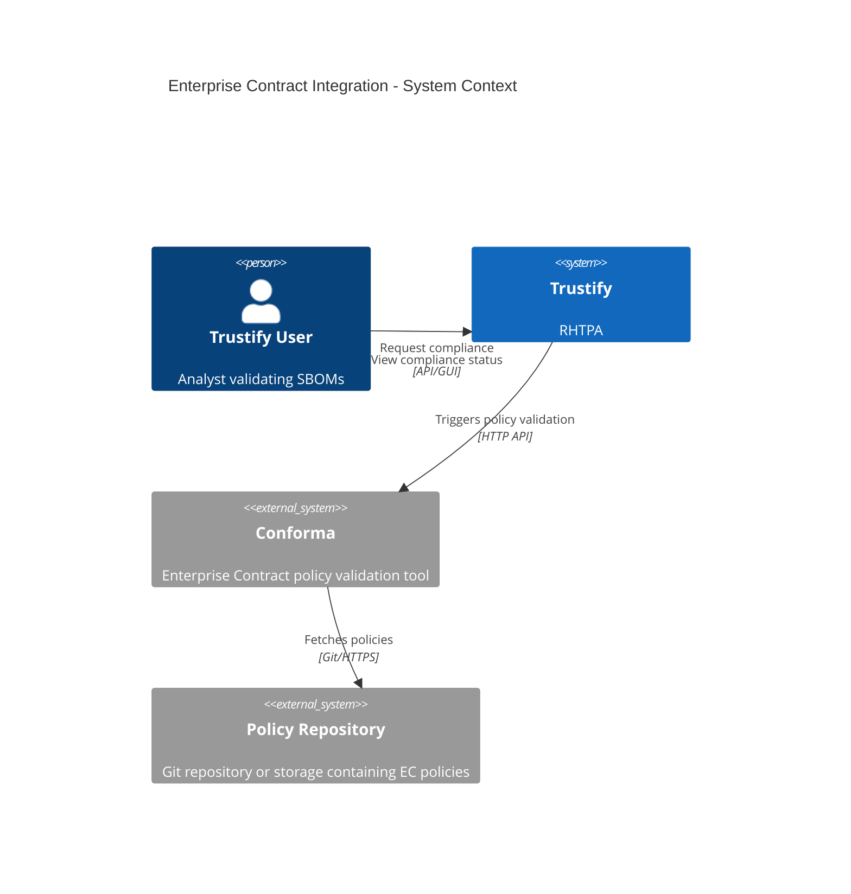
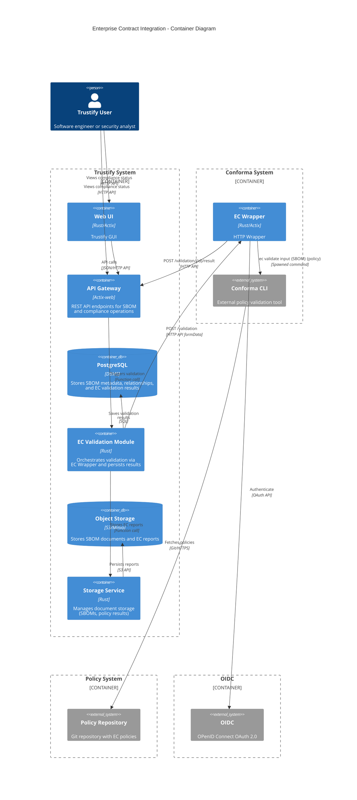
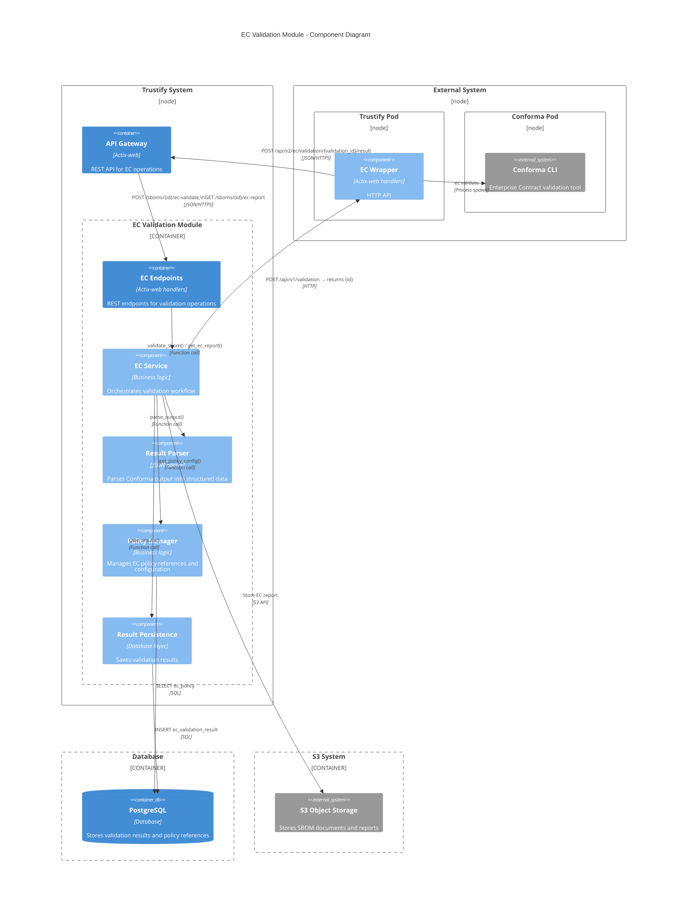
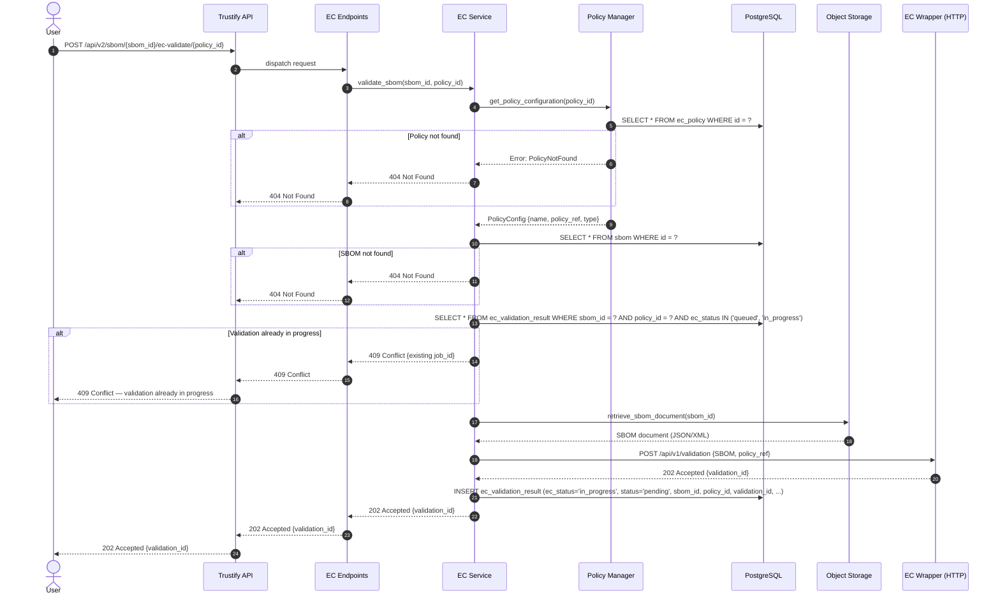
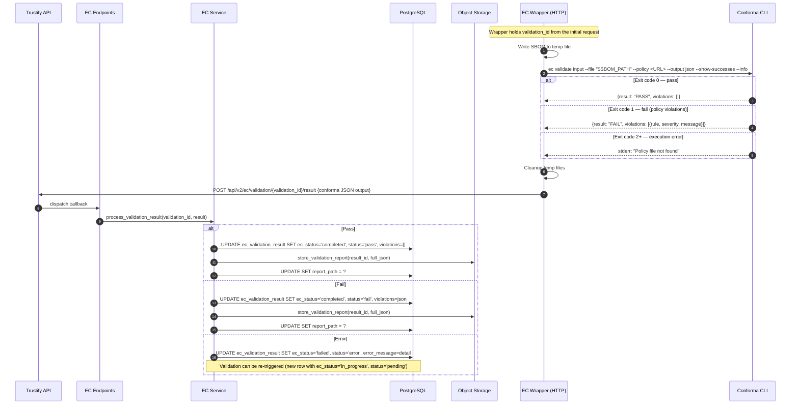

# 00014. Enterprise Contract Integration

Date: 2026-02-03

## Status

PROPOSED

## Context

Trustify provides SBOM storage, analysis, and vulnerability tracking but lacks automated policy enforcement. Organizations need to validate SBOMs against security and compliance policies (licensing, vulnerabilities, provenance) without relying on manual, inconsistent review processes.

Enterprise Contract (Conforma) is an open-source policy enforcement tool actively maintained by Red Hat. It validates SBOMs against configurable policies and produces structured JSON output. Currently it provides only a CLI; a REST API is planned but with no committed timeline.

### Requirements

Users need the ability to:

1. Validate SBOMs against organizational policies
2. Define and manage multiple policy configurations
3. View compliance status and violation details for each SBOM
4. Track compliance history over time
5. Generate detailed compliance reports for auditing
6. Receive actionable feedback on policy violations

## Decision

We will integrate Conforma into Trustify as a user triggered validation service by interacting with Conforma CLI.  
Validation is manually triggered — not automatic on SBOM upload.  
Validation on upload is deferred to a follow-up version.
Trustify stores information to identify (id, name, URL) of Policies.
A default Policy is defined at the application level (global policy) which is used for validation when an SBOM does not have any Policy explicitly attached to it.

Conforma CLI is deployed separately from Trustify as either a standalone container or equivalent.
An EC Wrapper (HTTP service) acts as a proxy between Trustify's EC service and Conforma CLI.

Each SBOM + policy pair has two validation states .

The validation process state of the EC Wrapper follows this lifecycle:

- **Queued** — a user has triggered validation; the request is being processed. Other users can see this state, preventing duplicate validation runs for the same SBOM + policy pair.
- **In Progress** — the request has been submitted to EC Wrapper.
- **Completed** — the outcome of the request has been received back from EC Wrapper.
- **Failed** — an execution error occurred (CLI crash, policy fetch failure, timeout). The error is surfaced separately, and the validation can be re-triggered.

The Policy validation outcome follows this lifecycle:

- **Pending** — initial state, indicates no validation has been triggered yet for this SBOM against this policy.
- **Fail** — Conforma validation found policy violations; violation details are linked.
- **Pass** — Conforma validation succeeded; the SBOM satisfies the policy.
- **Error** — The Conforma validation has generated an error.

The `ec_status` "In Progress" state serves as a concurrency guard: if a validation is already running for a given SBOM + policy pair, subsequent requests are rejected (409 Conflict), preventing duplicate work.

What is stored where

- PostgreSQL: validation process state (`ec_status`), validation outcome (`status`), structured violations (JSONB), summary statistics, foreign keys to SBOM and policy. Indexed on sbom_id, ec_status, status, start_time.
- Storage system: full raw Conforma JSON report, linked from the DB row via report_path. Keeps DB rows small while preserving audit completeness.
- Not stored: the policy definitions themselves. ec_policy stores references (URLs, OCI refs) that Conforma fetches at runtime.

Storing full JSON in storage system rather than only a summary was chosen explicitly to preserve audit completeness — callers can always fetch the raw report. The DB violations JSONB holds enough structure for filtering and dashboards without duplicating the full payload.

## Consequences

Using an EC Wrapper decouples the validation process into an external service. This better caters for large-scale deployments as EC validation has its own resource constraints. Meanwhile it adds infrastructure complexity as the EC Wrapper must be deployed and maintained alongside the Conforma CLI.

Within the EC Wrapper, Conforma is invoked via CLI spawning rather than a native API. This introduces an operational dependency (Conforma must be installed and version-pinned on every EC Wrapper instance) and per-validation process spawning overhead. These are accepted trade-offs given that no Conforma REST API exists yet. On the Trustify side, the EC service interacts with the EC Wrapper over HTTP and is built behind an adapter interface, so the implementation can be swapped for a direct Conforma REST client when one becomes available, without changes to the service layer or API.

### Alternatives Considered

#### In-Process Policy Engine: Rejected

Reimplementing Enterprise Contract logic in Rust would diverge from upstream and create significant maintenance burden.

#### Direct Integration: Rejected

Couple validation integrated within Trustify service through a directly controlled component was simpler but worse for large-scale deployments.

#### Embedded WASM Module: Rejected

Conforma is not available as WASM and would require major upstream changes.

#### Batch Processing Queue: Deferred

A Redis/RabbitMQ queue would improve retry handling and priority management; implement if the 429-based rejection approach proves insufficient under real load.

## The solution

### System Architecture



### Container Diagram - EC Validation Module



### Component Diagram



### Sequence Diagram — User Request (synchronous)



### Sequence Diagram — Async Validation Processing



### The Data Model

**`ec_policy`** - Stores references to external policies, not the policies themselves

- `id` (UUID, PK)
- `name` (VARCHAR, unique) - User-friendly name label
- `description` (TEXT) - What this policy enforces
- `policy_ref` (VARCHAR) - Git URL, OCI registry, or file path
- `policy_type` (VARCHAR) - 'git', 'oci', 'local'
- `configuration` (JSONB) - Branch, tag, auth credentials, etc.
- `created_at`, `updated_at` (TIMESTAMP)

**`ec_validation_result`** - one row per validation execution

- `id` (UUID, PK)
- `sbom_id` (UUID, FK → sbom)
- `policy_id` (UUID, FK → ec_policy)
- `ec_status` (ENUM) - 'queued', 'in_progress', 'completed', 'failed'
- `status` (ENUM) - 'pending', 'pass', 'fail', 'error'
- `violations` (JSONB) - Structured violation data for querying
- `summary` (JSONB) - Total checks, passed, failed, warnings
- `report_path` (VARCHAR) - File system or S3 path to detailed report
- `start_time` (TIMESTAMP)
- `end_time` (TIMESTAMP)
- `policy_version` (VARCHAR) - Policy commit hash or tag resolved at validation time
- `error_message` (TEXT) - Populated only on error status

### Trustify API Endpoints

```
POST   /api/v2/ec/policy                    # Create policy reference (admin)
GET    /api/v2/ec/policy                    # List policy references
GET    /api/v2/ec/policy/{id}               # Get policy reference
PUT    /api/v2/ec/policy/{id}               # Update policy reference (admin)
DELETE /api/v2/ec/policy/{id}               # Delete policy reference (admin)

POST   /api/v2/ec/validate?sbom_id={id}&policy_id={id}        # Trigger validation
GET    /api/v2/ec/report?sbom_id={id}&policy_id={id}          # Get latest validation result
GET    /api/v2/ec/report/history?sbom_id={id}&policy_id={id}  # Get validation history
GET    /api/v2/ec/report/{result_id}                          # Download detailed report from S3

POST   /api/v2/ec/validation/{validation_id}/result       # Callback: EC Wrapper posts Conforma result
```

## Conforma EC Wrapper API Endpoints

```
POST   /api/v1/validate                     # Validate uploaded SBOM file against the provided Policy URL (multipart form)
```

### Trustify Module Structure

```
modules/ec/
├── Cargo.toml
└── src/
    ├── lib.rs
    ├── endpoints/
    │   └── mod.rs              # REST endpoints
    ├── model/
    │   ├── mod.rs
    │   ├── policy.rs           # Policy API models
    │   └── validation.rs       # Validation result models
    ├── service/
    │   ├── mod.rs
    │   ├── ec_service.rs       # Main orchestration
    │   ├── policy_manager.rs   # Policy configuration
    │   ├── executor.rs         # EC Wrapper HTTP client (adapter)
    │   └── result_parser.rs    # Output parsing
    └── error.rs                # Error types
```

### HTTP Wrapper Module Structure

```
├── Cargo.toml
└── server
    ├── lib.rs
    ├── endpoints/
    │   └── mod.rs              # REST endpoints
    └── error.rs                # Error types
```

### Technical Considerations

#### Conforma CLI Execution (HTTPEC Wrapper)

The HTTP Wrapper invokes Conforma via process spawning (e.g., `tokio::process::Command`). All arguments are passed as an array — never as a shell string — to prevent CLI injection. Execution has a configurable timeout (default 5 minutes); large SBOMs are written to a temp file and passed by path rather than piped via stdin, which avoids OOM issues.

Exit codes are treated as follows: 0 = pass, 1 = policy violations (expected failure, not an error), 2+ = execution error. It is important to distinguish 1 from 2+ in error handling — a policy violation is a valid result that should be surfaced to the user, not treated as a system failure.

Temp files (SBOM, any cached policy material) are cleaned up in a finally-equivalent block regardless of execution outcome, including on timeout.

#### Concurrency and Backpressure

On the EC Wrapper side, concurrent Conforma processes are bounded by a semaphore (default: 5). When the semaphore is exhausted, the EC Wrapper returns 429 Too Many Requests to Trustify, which propagates the status to the caller. This makes the capacity limit explicit to callers (e.g., CI pipelines can implement their own retry with backoff). On the Trustify side, the `ec_status` "In Progress" concurrency guard (409 Conflict) prevents duplicate validation runs for the same SBOM + policy pair. If demand grows to warrant it, a proper queue (Redis/RabbitMQ) is the deferred alternative considered below.

#### Policy Management

ec_policy stores external references only. Conforma fetches the actual policy at validation time, which means Trustify does not cache policy content by default. The trade-off: validation always uses the latest policy version, but network failures or policy repo outages will cause execution errors. For private policy repositories, authentication credentials are stored in the configuration JSONB column and will be encrypted using AES crate; they are never logged.

The policy commit hash/tag (`policy_version`) resolved at validation time are recorded in each result row, enabling reproducibility and audit.

#### Multi-tenancy

Policy references are global (shared across all users) in this initial implementation. Per-organization policy namespacing is out of scope here and should be addressed in a dedicated multi-tenancy ADR when Trustify adds org-level isolation more broadly.

### Structure of JSON returned from Conforma CLI validation request (from an example)

```json
{
  "success": false,
  "filepaths": [
    {
      "filepath": "sboms/registry.redhat.io__rhtas__ec-rhel9__sha256__ea49a30eef5a2948b04540666a12048dd082625ce9f755acd3ece085c7d7937e.json",
      "violations": [
        {
          "msg": "There are 2942 packages which is more than the permitted maximum of 510.",
          "metadata": {
            "code": "hello_world.minimal_packages",
            "description": "Just an example... To exclude this rule add \"hello_world.minimal_packages\" to the `exclude` section of the policy configuration.",
            "solution": "You need to reduce the number of dependencies in this artifact.",
            "title": "Check we don't have too many packages"
          }
        }
      ],
      "warnings": [],
      "successes": [
        {
          "msg": "Pass",
          "metadata": {
            "code": "hello_world.valid_spdxid",
            "description": "Make sure that the SPDXID value found in the SBOM matches a list of allowed values.",
            "title": "Check for valid SPDXID value"
          }
        }
      ],
      "success": false,
      "success-count": 1
    }
  ],
  "policy": {
    "sources": [
      {
        "policy": ["github.com/conforma/policy//policy/lib", "./policy"]
      }
    ]
  },
  "ec-version": "v0.8.83",
  "effective-time": "2026-03-03T14:36:55.807826709Z"
}
```

### References

- [Enterprise Contract (Conforma) GitHub](https://github.com/enterprise-contract/ec-cli)
- [Design Document](../design/enterprise-contract-integration.md)
- [ADR-00005: Upload API for UI](./00005-ui-upload.md) - Similar async processing pattern
- [ADR-00001: Graph Analytics](./00001-graph-analytics.md) - Database query patterns
