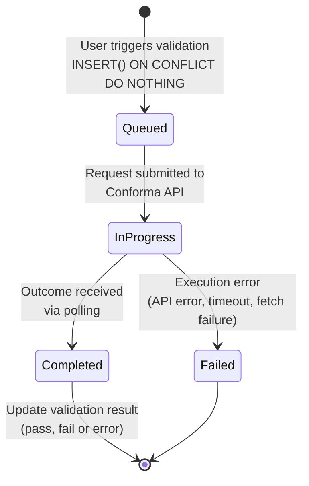
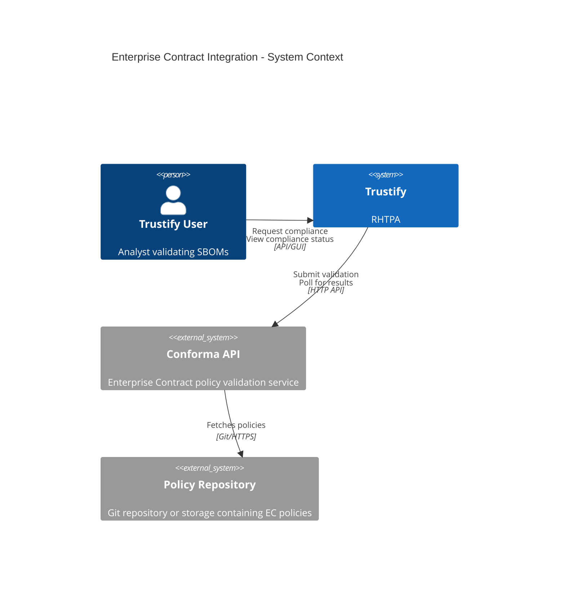
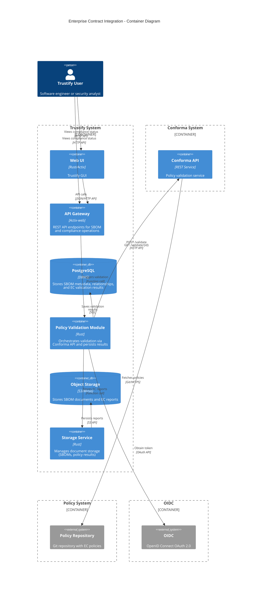
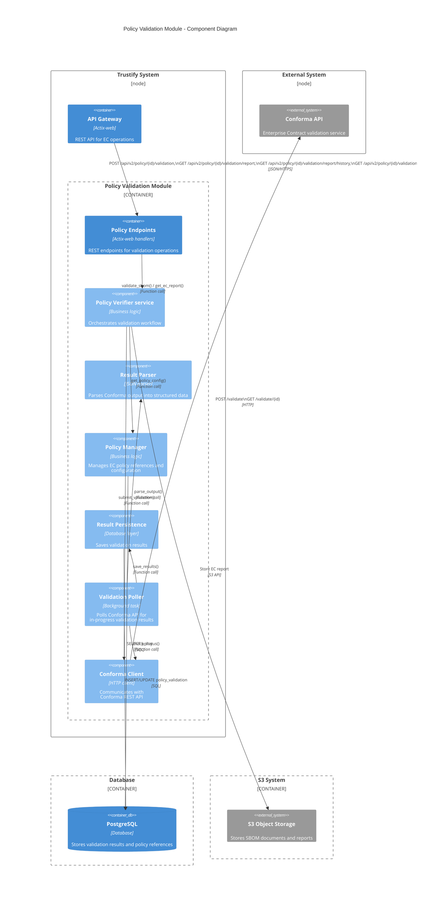
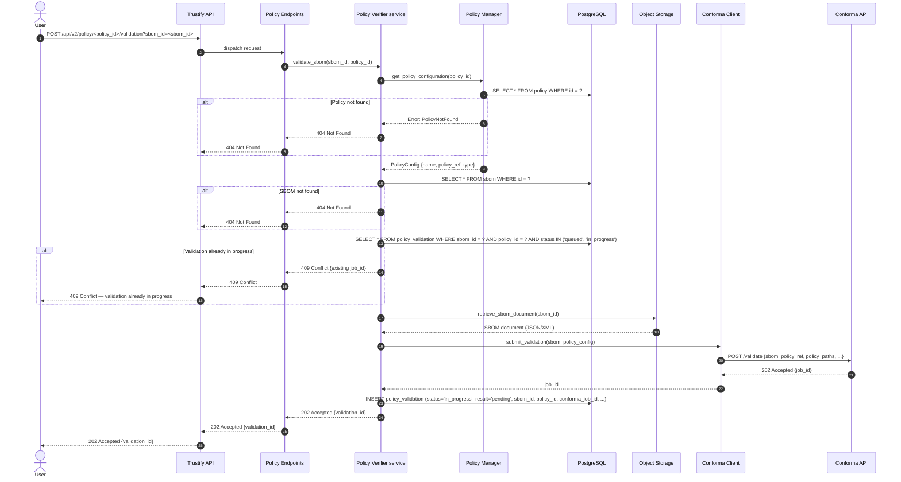
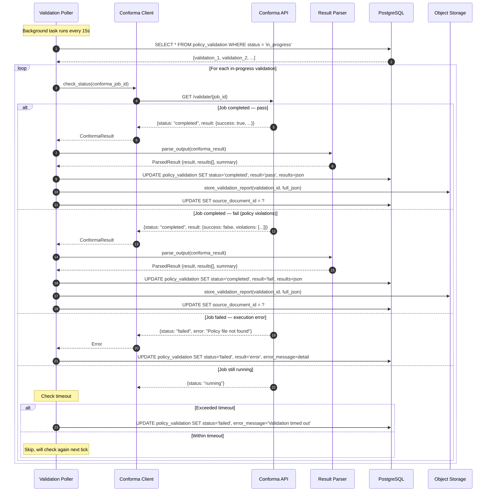

# 00014. Enterprise Contract Integration

Date: 2026-05-15

## Status

PROPOSED (supersedes previous APPROVED revision dated 2026-02-03)

## Context

Trustify provides SBOM storage, analysis, and vulnerability tracking but lacks automated policy enforcement. Organizations need to validate SBOMs against security and compliance policies (licensing, vulnerabilities, provenance) without relying on manual, inconsistent review processes.

Conforma (former Enterprise Contract) is an open-source policy enforcement tool actively maintained by Red Hat. It validates SBOMs against configurable policies and produces structured JSON output. Conforma is developing a REST API; this ADR targets that API as the integration point.

### Requirements

Users need the ability to:

1. Validate SBOMs against organizational policies
2. Define and manage multiple policy configurations
3. View compliance status and violation details for each SBOM
4. Track compliance history over time
5. Generate detailed compliance reports for auditing
6. Receive actionable feedback on policy violations

## Decision

Integrate Conforma into Trustify as a user-triggered validation service by communicating directly with the Conforma REST API.
Validation is manually triggered — not automatic on SBOM upload.
Trustify stores information to identify (id, name, URL) of Policies.

Conforma is assumed to be deployed separately from Trustify as a standalone service.

Trustify's Policy Verifier service communicates directly with the Conforma API over HTTP to submit validation requests and poll for results.

### Why a separate Conforma service

Policy validation can be very resource-intensive, especially for large SBOMs with thousands of packages, and running it in a dedicated service provides:

- **Resource isolation** — A long-running or memory-heavy validation cannot degrade Trustify's responsiveness.
- **Independent scaling** — The Conforma service can be scaled horizontally based on validation demand without scaling the entire Trustify deployment. Conversely, Trustify can scale for query load without provisioning excess capacity for validation.
- **Failure containment** — A Conforma service failure (OOM kill, policy fetch timeout, internal error) is isolated from Trustify. Trustify detects failures via polling and transitions the validation to a terminal `failed` state. The user can then queue a new validation.
- **Version independence** — The Conforma service can be upgraded or rolled back on its own release cadence, without redeploying Trustify. This is important given Conforma's active development pace.

### Validation process state

Each SBOM + policy pair has two validation states.

To track the progress of the external validation through the Conforma API, the following states are used:

- **Queued** — a user has triggered validation; the request is being processed. Other users can see this state, preventing duplicate validation runs for the same SBOM + policy pair.
- **In Progress** — the request has been submitted to the Conforma API.
- **Completed** — the outcome has been received from the Conforma API.
- **Failed** — an execution error occurred (API error, policy fetch failure, timeout). This is a terminal state; the error is surfaced to the user, who may manually queue a new validation run.



The result of a Policy validation is updated only when the validation process is completed.

### What is stored where

- PostgreSQL: validation process state (`status`), validation outcome (`result`), structured results (JSONB), summary statistics, foreign keys to SBOM and policy. Indexed on sbom_id, status.
- Storage system: full raw Conforma JSON report, linked from the DB row via `source_document.id`. Keeps DB rows small while preserving audit completeness.
- Not stored: the policy definitions themselves. Policy stores references (URLs, OCI refs) that Conforma fetches at runtime.

Storing full JSON in storage system rather than only a summary was chosen explicitly to preserve audit completeness — callers can always fetch the raw report. The DB results JSONB holds enough structure for filtering and dashboards without duplicating the full payload.

## Consequences

### Direct API Integration

Trustify communicates directly with the Conforma REST API — no intermediary wrapper or CLI process spawning is involved. The Policy Verifier service in Trustify acts as an HTTP client to the Conforma API.

The Conforma API contract expected by Trustify is documented in the [Expected Conforma API Contract](#expected-conforma-api-contract) section below; the actual contract will be finalized in collaboration with the Conforma team.

### Polling-based result retrieval

Trustify uses a background poller to retrieve validation results from the Conforma API. The poller runs as a recurring task within Trustify's Policy Verifier service:

1. On each tick (default interval: 15 seconds), it queries for all `policy_validation` rows with `status = 'in_progress'`.
2. For each in-progress validation, it calls the Conforma API status endpoint to check whether the job has completed.
3. If completed, it fetches the full result, parses it, persists the outcome and the raw report, and transitions the row to `completed`.
4. If the Conforma API reports a failure, the row is transitioned to `failed` with the error detail.
5. If the validation has been `in_progress` longer than the configured timeout (default: 5 minutes, overridable per-policy via `timeout_seconds`), the row is transitioned to `failed` with `"Validation timed out"`.

This approach is simpler than a callback model because:

- Conforma does not need to know Trustify's API or authenticate back to it.
- No bidirectional OIDC configuration is required.
- Trustify controls the polling frequency and timeout behavior entirely.
- Network topology is simpler: only Trustify → Conforma traffic, no reverse path.

### Alternatives Considered

#### CLI + HTTP Wrapper: Superseded

The previous revision of this ADR (dated 2026-02-03) proposed a Conforma HTTP Wrapper — a custom HTTP service deployed alongside the Conforma CLI that would accept validation requests, spawn `ec validate` as a subprocess, and POST results back to Trustify via a callback endpoint. This approach was approved when no Conforma REST API existed but introduced significant operational complexity:

- A custom wrapper service to develop, deploy, monitor, and maintain.
- CLI process spawning with per-validation overhead and OOM/crash risks.
- A bidirectional OIDC configuration (Trustify → Wrapper and Wrapper → Trustify).
- A callback endpoint on Trustify requiring dedicated authentication.

The Conforma REST API eliminates all of these concerns by providing a standard, well-defined integration point that Trustify can consume as an HTTP client.

#### In-Process Policy Engine: Rejected

Reimplementing Enterprise Contract logic in Rust would diverge from upstream and create significant maintenance burden.

#### Embedded WASM Module: Rejected

Conforma is not available as WASM and would require major upstream changes.

#### Batch Processing Queue: Deferred

A Redis/RabbitMQ queue would improve retry handling and priority management; implement if the polling-based approach proves insufficient under real load.

## Details

### System Architecture



### Container Diagram - Policy Validation Module



### Component Diagram



### Sequence Diagram — User Request (synchronous)



### Sequence Diagram — Async Result Polling



### The Data Model

**`policy`** - Stores references to external policies, not the policies themselves

- `id` (UUID, PK)
- `name` (VARCHAR, unique) - User-friendly name label
- `description` (TEXT) - What this policy enforces
- `policy_type` (ENUM) - 'Conforma'
- `configuration` (JSONB) - See model below
- `revision`(UUID) - Conditional UPDATE filtering both the primary key and the current revision

**`policy.configuration` JSONB model:**

| Field                  | Type     | Required        | Description                                                                                           |
| ---------------------- | -------- | --------------- | ----------------------------------------------------------------------------------------------------- |
| `policy_ref`           | string   | yes             | Policy source URL, e.g. `"git://[URL]?ref=[BRANCH OR TAG]"`                                           |
| `auth`                 | object   | no              | Credentials for private repos; sensitive values encrypted via `ring::aead` AES-256-GCM (never logged) |
| `auth.type`            | string   | yes (if `auth`) | `"token"`, `"ssh_key"`, or `"none"`                                                                   |
| `auth.token_encrypted` | string   | no              | AES-256-GCM encrypted bearer/PAT token, prefixed with encryption scheme                               |
| `policy_paths`         | string[] | no              | Sub-paths within the repo to evaluate                                                                 |
| `exclude`              | string[] | no              | Rule codes to skip during validation                                                                  |
| `include`              | string[] | no              | If non-empty, only these rule codes are evaluated                                                     |
| `timeout_seconds`      | integer  | no              | Per-policy override of the default 5-minute execution timeout                                         |

`policy.configuration` example:

```json
{
  "policy_ref": "git://github.com/org/policy-repo?ref=main",
  "auth": {
    "type": "token",
    "token_encrypted": "AES-256-GCM:<base64-nonce>:<base64-ciphertext>"
  },
  "policy_paths": ["policy/lib", "policy/release"],
  "exclude": ["hello_world.minimal_packages"],
  "include": [],
  "timeout_seconds": 300
}
```

**`policy_validation`** - one row per validation execution

- `id` (UUID, PK)
- `sbom_id` (UUID, FK → sbom)
- `policy_id` (UUID, FK → policy)
- `conforma_job_id` (VARCHAR) - Job ID returned by the Conforma API, used for polling
- `status` (ENUM) - 'null', 'queued', 'in_progress', 'completed', 'failed'
- `error`(TEXT) - Error message
- `result` (ENUM) - 'null', 'fail', 'pass' or 'error'
- `results` (JSONB) - See model below
- `success` (BOOL) - Overall pass/fail outcome (mirrors Conforma's top-level `success` field)
- `total` (NUMBER) - Total number of checks evaluated
- `violations`(NUMBER) - Count of checks with violation severity
- `warnings` (NUMBER) - Count of checks with warning severity
- `successes` (NUMBER) - Count of checks that passed
- `type_metadata` (JSONB) - Policy validator specific data
- `validation_time` (DATETIME) - Evaluation duration
- `source_document_id` (VARCHAR) - File system or S3 id of the detailed report
- `error_message` (TEXT) - Populated only on error status

**`policy_validation.results` JSONB model:**

| Field                  | Type   | Required | Description                                         |
| ---------------------- | ------ | -------- | --------------------------------------------------- |
| `severity`             | string | yes      | `"violation"`, `"warning"`, or `"success"`          |
| `msg`                  | string | yes      | Human-readable message describing the check outcome |
| `metadata`             | object | yes      | Rule metadata, preserved as-is from Conforma output |
| `metadata.code`        | string | yes      | Rule identifier for filtering and deduplication     |
| `metadata.title`       | string | yes      | Short rule title                                    |
| `metadata.description` | string | no       | Detailed explanation of what the rule checks        |
| `metadata.solution`    | string | no       | Suggested remediation (absent for successes)        |

`policy_validation.results` example:

```json
[
  {
    "severity": "violation",
    "msg": "There are 2942 packages which is more than the permitted maximum of 510.",
    "metadata": {
      "code": "hello_world.minimal_packages",
      "title": "Check we don't have too many packages",
      "description": "Just an example... To exclude this rule add \"hello_world.minimal_packages\" to the `exclude` section of the policy configuration.",
      "solution": "You need to reduce the number of dependencies in this artifact."
    }
  },
  {
    "severity": "warning",
    "msg": "Deprecated license format detected.",
    "metadata": {
      "code": "license.format_check",
      "title": "License format validation",
      "description": "Checks that license identifiers follow the SPDX specification.",
      "solution": "Update license identifiers to valid SPDX expressions."
    }
  },
  {
    "severity": "success",
    "msg": "Pass",
    "metadata": {
      "code": "hello_world.valid_spdxid",
      "title": "Check for valid SPDXID value",
      "description": "Make sure that the SPDXID value found in the SBOM matches a list of allowed values."
    }
  }
]
```

**`policy_validation.type_metadata` JSONB model in the Conforma case:**

| Field              | Type   | Required | Description                                |
| ------------------ | ------ | -------- | ------------------------------------------ |
| `conforma_version` | string | yes      | Version of Conforma API (e.g. `"v0.8.83"`) |

`policy_validation.type_metadata` example:

```json
{
  "conforma_version": "v0.8.83"
}
```

#### Data Model Implementation

```rust
enum ValidatorKind {
    Null,
    Conforma,
}
```

```rust
/// The policy reference information
#[derive(Serialize, Deserialize)]
struct Policy {
    id: String,
    name: String,
    #[serde(default, skip_serializing_if = "Option::is_none")]
    description: Option<String>,
    policy_type: ValidatorKind,
    configuration: serde_json::Value,
    /// Conditional updates compare this revision (also exposed as `ETag` on GET).
    revision: Uuid,
}
```

```rust
/// Policy information that can be mutated
#[derive(Serialize, Deserialize)]
struct PolicyRequest {
    name: String,
    #[serde(default, skip_serializing_if = "Option::is_none")]
    description: Option<String>,
    policy_type: ValidatorKind,
    configuration: serde_json::Value,
}
```

```rust
/// Credentials for private policy repos (`policy.configuration.auth`)
#[derive(Serialize, Deserialize)]
struct PolicyAuth {
    /// `"token"`, `"ssh_key"`, or `"none"`
    #[serde(rename = "type")]
    auth_type: String,
    #[serde(default, skip_serializing_if = "Option::is_none")]
    token_encrypted: Option<String>,
}
```

```rust
/// Policy configuration (stored as JSONB)
#[derive(Serialize, Deserialize)]
struct PolicyConfiguration {
    policy_ref: String,
    #[serde(default, skip_serializing_if = "Option::is_none")]
    auth: Option<PolicyAuth>,
    #[serde(default, skip_serializing_if = "Vec::is_empty")]
    policy_paths: Vec<String>,
    #[serde(default, skip_serializing_if = "Vec::is_empty")]
    exclude: Vec<String>,
    #[serde(default, skip_serializing_if = "Vec::is_empty")]
    include: Vec<String>,
    #[serde(default, skip_serializing_if = "Option::is_none")]
    timeout_seconds: Option<u32>,
}
```

```rust
/// Conforma-specific `policy_validation.type_metadata`
#[derive(Serialize, Deserialize)]
struct ConformaTypeMetadata {
    conforma_version: String,
}
```

```rust
/// One row per validation execution (`policy_validation`)
#[derive(Serialize, Deserialize)]
struct PolicyValidation {
    id: String,
    sbom_id: String,
    policy_id: String,
    /// Job ID from the Conforma API, used for polling
    #[serde(default, skip_serializing_if = "Option::is_none")]
    conforma_job_id: Option<String>,
    /// Lifecycle: `'null'`, `'queued'`, `'in_progress'`, `'completed'`, `'failed'`
    status: String,
    #[serde(default, skip_serializing_if = "Option::is_none")]
    error: Option<String>,
    /// Present once `status` is `'completed'` or `'failed'`
    #[serde(default, skip_serializing_if = "Option::is_none")]
    outcome: Option<ValidationOutcome>,
}
```

```rust
/// Outcome produced when a validation finishes (all-or-nothing)
#[derive(Serialize, Deserialize)]
struct ValidationOutcome {
    /// `'fail'`, `'pass'`, `'error'`
    result: String,
    results: Vec<PolicyValidationResult>,
    success: bool,
    total: u32,
    violations: u32,
    warnings: u32,
    successes: u32,
    #[serde(default, skip_serializing_if = "Option::is_none")]
    type_metadata: Option<ConformaTypeMetadata>,
    validation_time: String,
    #[serde(default, skip_serializing_if = "Option::is_none")]
    source_document_id: Option<String>,
    #[serde(default, skip_serializing_if = "Option::is_none")]
    error_message: Option<String>,
}
```

```rust
/// A single check result within `policy_validation.results`
#[derive(Serialize, Deserialize)]
#[serde(tag = "severity")]
enum PolicyValidationResult {
    #[serde(rename = "violation")]
    Violation {
        msg: String,
        metadata: PolicyValidationResultMetadata,
    },
    #[serde(rename = "warning")]
    Warning {
        msg: String,
        metadata: PolicyValidationResultMetadata,
    },
    #[serde(rename = "success")]
    Success {
        msg: String,
        metadata: PolicyValidationResultMetadata,
    },
}
```

```rust
#[derive(Serialize, Deserialize)]
struct PolicyValidationResultMetadata {
    code: String,
    title: String,
    #[serde(default, skip_serializing_if = "Option::is_none")]
    description: Option<String>,
    #[serde(default, skip_serializing_if = "Option::is_none")]
    solution: Option<String>,
}
```

## Trustify API Endpoints

```
POST   /api/v2/policy                                                  # Create a new policy reference
GET    /api/v2/policy                                                  # List policy references
GET    /api/v2/policy/{id}                                             # Get a single policy reference
PUT    /api/v2/policy/{id}                                             # Update a policy reference
DELETE /api/v2/policy/{id}                                             # Delete a policy reference
POST   /api/v2/policy/{id}/validation                                  # Trigger policy validation
GET    /api/v2/policy/{id}/validation/report                           # Get latest validation result
GET    /api/v2/policy/{id}/validation/report/history                   # Get validation history
GET    /api/v2/policy/{id}/validation/report/{result_id}               # Download full report
```

### Permissions

The policy module introduces the following permissions, following the existing Trustify CRUD convention:

| Permission      | Description                                                        |
| --------------- | ------------------------------------------------------------------ |
| `create.policy` | Create policy references and trigger validations                   |
| `read.policy`   | List/get policy references and read validation results and reports |
| `update.policy` | Update policy references                                           |
| `delete.policy` | Delete policy references                                           |

These permissions map to the default OIDC scope groups:

| Scope             | Permissions granted |
| ----------------- | ------------------- |
| `create:document` | `create.policy`     |
| `read:document`   | `read.policy`       |
| `update:document` | `update.policy`     |
| `delete:document` | `delete.policy`     |

Endpoint permission requirements:

| Endpoint                                                | Permission      |
| ------------------------------------------------------- | --------------- |
| `POST /api/v2/policy`                                   | `create.policy` |
| `GET /api/v2/policy`                                    | `read.policy`   |
| `GET /api/v2/policy/{id}`                               | `read.policy`   |
| `PUT /api/v2/policy/{id}`                               | `update.policy` |
| `DELETE /api/v2/policy/{id}`                            | `delete.policy` |
| `POST /api/v2/policy/{id}/validation`                   | `create.policy` |
| `GET /api/v2/policy/{id}/validation/report`             | `read.policy`   |
| `GET /api/v2/policy/{id}/validation/report/history`     | `read.policy`   |
| `GET /api/v2/policy/{id}/validation/report/{result_id}` | `read.policy`   |

### POST `/api/v2/policy`

Create a new policy reference.

#### Request

| part | name | type            | description |
| ---- | ---- | --------------- | ----------- |
| body | -    | `PolicyRequest` |             |

#### Response

- 201 - the policy was created

  ```yaml
  id: <id> # ID of the created policy
  ```

  And:

  ```
  Location: /api/v2/policy/<id>
  ```

- 400 - if the request could not be understood
- 401 - if the user was not authenticated
- 403 - if the user was authenticated but not authorized
- 409 - if a policy with the same name already exists

### GET `/api/v2/policy`

List policy references, optionally filtered.

By default, the entries will be sorted by name ascending.

#### Request

| part  | name     | type       | description                                             |
| ----- | -------- | ---------- | ------------------------------------------------------- |
| query | `q`      | "q" string | "q style" query string                                  |
| query | `limit`  | u64        | Maximum number of items to return                       |
| query | `offset` | u64        | Initial items to skip before actually returning results |

The following `q` parameters are supported:

- `name`: Filters policies by their name.

#### Response

- 200 - if the user is allowed to read policies

  ```rust
  #[derive(Serialize, Deserialize)]
  struct PaginatedPolicy {
      total: u64,
      items: Vec<Policy>,
  }
  ```

- 401 - if the user was not authenticated
- 403 - if the user was authenticated but not authorized

### GET `/api/v2/policy/{id}`

Get a single policy reference by ID.

#### Request

| part | name | type     | description             |
| ---- | ---- | -------- | ----------------------- |
| path | `id` | `String` | ID of the policy to get |

#### Response

- 200 - if the policy was found

  | part    | name   | type     | description                        |
  | ------- | ------ | -------- | ---------------------------------- |
  | body    | -      | `Policy` | The policy information             |
  | headers | `ETag` | string   | Value which indicates the revision |

- 401 - if the user was not authenticated
- 404 - if the policy was not found or the user doesn't have permission to read this policy

### PUT `/api/v2/policy/{id}`

Update an existing policy reference.

#### Request

| part   | name      | type             | description                    |
| ------ | --------- | ---------------- | ------------------------------ |
| path   | `id`      | `String`         | ID of the policy to update     |
| header | `IfMatch` | `Option<String>` | ETag value, revision to update |
| body   | -         | `PolicyRequest`  | The new content                |

#### Response

- 204 - the policy was updated
- 400 - if the request could not be understood
- 401 - if the user was not authenticated
- 403 - if the user was authenticated but not authorized
- 404 - if the policy was not found
- 409 - if a policy with the same name already exists
- 412 - if the `IfMatch` header was present, but its value didn't match the stored revision

### DELETE `/api/v2/policy/{id}`

Delete an existing policy reference.

Deleting a policy will fail if there are validation results referencing it.

#### Request

| part   | name      | type             | description                    |
| ------ | --------- | ---------------- | ------------------------------ |
| path   | `id`      | `String`         | ID of the policy to delete     |
| header | `IfMatch` | `Option<String>` | ETag value, revision to delete |

#### Response

- 204 - if the policy was successfully deleted
- 204 - if the policy was already deleted
- 400 - if the request could not be understood
- 401 - if the user was not authenticated
- 403 - if the user was authenticated but not authorized
- 409 - if the policy has associated validation results
- 412 - if the `IfMatch` header was present, but its value didn't match the stored revision

### POST `/api/v2/policy/{id}/validation`

Trigger policy validation for a given SBOM. The validation is performed asynchronously via the Conforma API; a `validation_id` is returned immediately.

If a validation is already in progress for the same SBOM + policy pair, the request is rejected with 409 Conflict.

#### Request

| part  | name      | type     | description                |
| ----- | --------- | -------- | -------------------------- |
| query | `sbom_id` | `String` | ID of the SBOM to validate |

#### Response

- 202 - the validation was accepted and queued

  ```rust
  #[derive(Serialize, Deserialize)]
  struct ValidationAccepted {
      validation_id: Uuid,
  }
  ```

- 400 - if the request could not be understood
- 401 - if the user was not authenticated
- 403 - if the user was authenticated but not authorized
- 404 - if the SBOM or policy was not found
- 409 - if a validation is already in progress for this SBOM + policy pair
- 502 - if the Conforma API is unreachable or returned an unexpected error
- 503 - if the Conforma API reported it cannot accept work at this time

### GET `/api/v2/policy/{id}/validation/report`

Get the latest validation result for a given SBOM.

#### Request

| part  | name      | type     | description    |
| ----- | --------- | -------- | -------------- |
| query | `sbom_id` | `String` | ID of the SBOM |

#### Response

- 200 - if a validation result exists

  | part | name | type               | description                  |
  | ---- | ---- | ------------------ | ---------------------------- |
  | body | -    | `PolicyValidation` | The latest validation result |

- 401 - if the user was not authenticated
- 403 - if the user was authenticated but not authorized
- 404 - if the SBOM or policy was not found, or no validation has been performed yet

### GET `/api/v2/policy/{id}/validation/report/history`

Get the validation history for a given SBOM (newest first; typically ordered by validation row creation time or id descending).

#### Request

| part  | name      | type       | description                                             |
| ----- | --------- | ---------- | ------------------------------------------------------- |
| query | `sbom_id` | `String`   | ID of the SBOM                                          |
| query | `q`       | "q" string | "q style" query string                                  |
| query | `limit`   | u64        | Maximum number of items to return                       |
| query | `offset`  | u64        | Initial items to skip before actually returning results |

The following `q` parameters are supported:

- `status`: Filters by processing status (`queued`, `in_progress`, `completed`, `failed`).
- `result`: Filters by verification status (`pending`, `pass`, `fail`, `error`).

#### Response

- 200 - if the SBOM and policy exist

  ```rust
  #[derive(Serialize, Deserialize)]
  struct PaginatedPolicyValidation {
      total: u64,
      items: Vec<PolicyValidation>,
  }
  ```

- 401 - if the user was not authenticated
- 403 - if the user was authenticated but not authorized
- 404 - if the SBOM or policy was not found

### GET `/api/v2/policy/{id}/validation/report/{result_id}`

Download the full raw Conforma JSON report from storage.

#### Request

| part | name        | type     | description                          |
| ---- | ----------- | -------- | ------------------------------------ |
| path | `result_id` | `String` | ID of the validation result to fetch |

#### Response

- 200 - if the report was found

  | part    | name           | type     | description                   |
  | ------- | -------------- | -------- | ----------------------------- |
  | body    | -              | raw JSON | The full Conforma JSON report |
  | headers | `Content-Type` | string   | `application/json`            |

- 401 - if the user was not authenticated
- 403 - if the user was authenticated but not authorized
- 404 - if the validation result or report was not found

## Expected Conforma API Contract

The following API contract is what Trustify expects from the Conforma REST API. This contract is aspirational and subject to change once the Conforma API is finalized. Trustify's Conforma client adapter is built behind a trait interface so the implementation can be adjusted to match the actual API without changes to the service layer.

### POST `/validate`

Submit an SBOM document and policy reference for validation.

#### Request

| part      | name            | type     | description                                                          |
| --------- | --------------- | -------- | -------------------------------------------------------------------- |
| header    | `Authorization` | `String` | `Bearer <access_token>` — token for Conforma API authentication      |
| multipart | `sbom`          | file     | The SBOM document to validate (JSON or XML)                          |
| multipart | `policy_ref`    | `String` | Policy source URL (e.g. `git://github.com/org/policy-repo?ref=main`) |
| multipart | `policy_paths`  | `String` | JSON-encoded array of sub-paths within the repo (optional)           |
| multipart | `exclude`       | `String` | JSON-encoded array of rule codes to skip (optional)                  |
| multipart | `include`       | `String` | JSON-encoded array of rule codes to evaluate exclusively (optional)  |

#### Response

- 202 - the validation was accepted and will be processed asynchronously

  ```json
  {
    "job_id": "<uuid>"
  }
  ```

- 400 - if the request could not be understood or required fields are missing
- 401 - if the caller was not authenticated
- 503 - if the service cannot accept work at this time

### GET `/validate/{job_id}`

Check the status of a previously submitted validation job and retrieve results when complete.

#### Request

| part   | name            | type     | description                                                     |
| ------ | --------------- | -------- | --------------------------------------------------------------- |
| path   | `job_id`        | `String` | Job ID returned in the 202 response                             |
| header | `Authorization` | `String` | `Bearer <access_token>` — token for Conforma API authentication |

#### Response

- 200 - job status and result (if completed)

  ```json
  {
    "job_id": "<uuid>",
    "status": "pending | running | completed | failed",
    "result": { ... },
    "error": "..."
  }
  ```

  When `status` is `"completed"`, `result` contains the full Conforma validation output (same structure as the current Conforma CLI JSON output). When `status` is `"failed"`, `error` contains a description of the failure.

- 401 - if the caller was not authenticated
- 404 - if the job ID was not found

## File Structure

```
modules/policy/
├── Cargo.toml
├── src/
│   ├── error.rs                # Error types
│   ├── lib.rs
│   ├── endpoints/
│   │   └── mod.rs              # REST endpoints
│   ├── model/
│   │   ├── mod.rs
│   │   ├── policy.rs           # Policy API models
│   │   └── validation.rs       # Validation result models
│   ├── service/
│   │   ├── mod.rs
│   │   ├── ec_service.rs       # Main orchestration
│   │   ├── policy_manager.rs   # Policy configuration
│   │   ├── result_parser.rs    # Output parsing
│   │   └── validation_poller.rs # Background polling task
│   └── client/
│        └── conforma.rs         # Conforma API HTTP client
```

## Technical Considerations

#### Conforma API Client Configuration

Trustify's Conforma client requires the following configuration to communicate with the Conforma API:

##### Environment Variables

| Variable                           | Required | Description                                                                                                   |
| ---------------------------------- | -------- | ------------------------------------------------------------------------------------------------------------- |
| `CONFORMA_API_URL`                 | yes      | Base URL of the Conforma API (e.g. `https://conforma.example.com`)                                            |
| `CONFORMA_API_AUTH_TYPE`           | no       | Authentication type: `"oidc"` (default) or `"api_key"`                                                        |
| `CONFORMA_OIDC_ISSUER_URL`         | cond.    | OIDC issuer URL, required when `auth_type` is `"oidc"`                                                        |
| `CONFORMA_OIDC_CLIENT_ID`          | cond.    | OIDC client ID for obtaining tokens, required when `auth_type` is `"oidc"`                                    |
| `CONFORMA_OIDC_CLIENT_SECRET`      | cond.    | OIDC client secret, required when `auth_type` is `"oidc"`                                                     |
| `CONFORMA_API_KEY`                 | cond.    | API key, required when `auth_type` is `"api_key"`                                                             |
| `CONFORMA_TLS_INSECURE`            | no       | Disable TLS certificate validation (default `false`; only for development)                                    |
| `CONFORMA_TLS_CA_CERTIFICATES`     | no       | Additional CA certificates to trust when communicating with the Conforma API                                  |
| `CONFORMA_POLL_INTERVAL_SECONDS`   | no       | Polling interval for the validation poller (default: 15 seconds)                                              |
| `CONFORMA_DEFAULT_TIMEOUT_SECONDS` | no       | Default validation timeout (default: 300 seconds), overridable per-policy via `configuration.timeout_seconds` |

##### Authentication

When `auth_type` is `"oidc"`, the Conforma client uses the OAuth 2.0 Client Credentials Grant to obtain an access token from the OIDC provider. The token is cached and refreshed proactively before expiry (with a 30-second safety margin).

When `auth_type` is `"api_key"`, the client sends the key in the `Authorization` header as `Bearer <api_key>`.

The authentication mechanism is defined behind a trait so additional schemes can be added without modifying the core client logic.

##### Security Considerations

- Client secrets and API keys must be stored securely (e.g. Kubernetes Secret, vault injection) and never logged.
- TLS is required for all communication with the Conforma API in production.
- The OIDC client registered for Trustify's Conforma integration should use a narrow scope that grants only the ability to submit and query validations.

#### Concurrency and Backpressure

Concurrency is controlled at two levels:

- **Trustify (duplicate prevention)** — Before forwarding a request to the Conforma API, the Policy Verifier service checks whether a validation is already queued or in progress for the same SBOM + policy pair. If one exists, the request is rejected with 409 Conflict, preventing duplicate work.
- **Conforma API (resource protection)** — The Conforma API manages its own internal concurrency limits. When it cannot accept additional work, it returns an appropriate error (e.g. 503 Service Unavailable), which Trustify propagates to the caller. This delegates capacity management to the service that owns the resources, avoiding the need for Trustify to maintain a semaphore or concurrency limit for an external service.

#### Validation Poller

The validation poller is a background task within the Policy Verifier service that periodically checks the Conforma API for completed validations:

- **Interval**: Configurable via `CONFORMA_POLL_INTERVAL_SECONDS` (default: 15 seconds).
- **Batch processing**: On each tick, it fetches all `in_progress` validation rows and checks their status with the Conforma API. Requests are made concurrently (bounded by an internal semaphore to avoid overwhelming the Conforma API).
- **Timeout detection**: If a validation has been `in_progress` longer than its configured timeout, the poller transitions it to `failed` without querying the Conforma API.
- **Idempotency**: The poller uses conditional updates (`UPDATE ... WHERE status = 'in_progress' AND id = ?`) so it is safe to run from multiple Trustify replicas concurrently.
- **Error handling**: If the Conforma API is temporarily unreachable during a poll cycle, the poller logs the error and retries on the next tick. Transient API errors do not cause validation failures — only persistent unreachability beyond the timeout window does.

#### Policy Management

When the `policy.policy_type` is `"Conforma"`, Trustify stores only external references and does not cache policy content. Conforma fetches the policy at validation time from the git source specified in `policy.configuration.policy_ref`.

The trade-off: validation always uses the latest policy content from the referenced branch or tag, but network failures or policy repo outages will cause execution errors. For private policy repositories, authentication credentials are stored in the `configuration` JSONB column and encrypted at rest using `ring::aead` (AES-256-GCM authenticated encryption); they are never logged. The `ring` crate is already a direct dependency of the project (used for digest hashing), so no new dependency is required.

The `policy_validation.type_metadata.conforma_version` field records the Conforma version used for the validation, enabling reproducibility and audit.

#### Kubernetes Deployment

When both Trustify and Conforma are deployed on a Kubernetes cluster, native K8s primitives complement the application-level controls:

- **Service discovery** — Trustify references the Conforma API via its Kubernetes `Service` DNS name (e.g. `conforma-api.trustify.svc.cluster.local`). This decouples Trustify from individual pod IPs and lets K8s load-balance requests across replicas.
- **Resource limits and requests** — Each Conforma API pod should declare CPU and memory `requests` and `limits` appropriate for its validation workload.
- **NetworkPolicy** — A Kubernetes `NetworkPolicy` can restrict ingress to the Conforma API pods so that only Trustify pods (selected by label) are allowed to reach the API. This provides network-layer defense-in-depth on top of token-based authentication.
- **Secrets management** — OIDC client secrets, API keys, and policy-repo credentials should be mounted from Kubernetes `Secret` resources (or injected via an external secrets operator) rather than embedded in environment variable literals.

## Future Work

#### Conforma API Availability

This ADR's implementation is contingent on the Conforma REST API becoming available. The expected API contract documented above will be refined in collaboration with the Conforma team. Trustify's client adapter is designed behind a trait interface to absorb API contract changes with minimal impact on the rest of the codebase.

#### Validation on SBOM upload

#### Multi-tenancy

Policy references are global (shared across all users) in this initial implementation. Per-organization policy namespacing is out of scope here and should be addressed in a dedicated multi-tenancy ADR when Trustify adds org-level isolation more broadly.

#### Receive actionable feedback on policy violations

This is out of scope of this ADR.

## References

- [Enterprise Contract (Conforma) GitHub](https://github.com/enterprise-contract/ec-cli)
- [Design Document](../design/enterprise-contract-integration.md)
- [ADR-00005: Upload API for UI](./00005-ui-upload.md) - Similar async processing pattern
- [ADR-00001: Graph Analytics](./00001-graph-analytics.md) - Database query patterns
