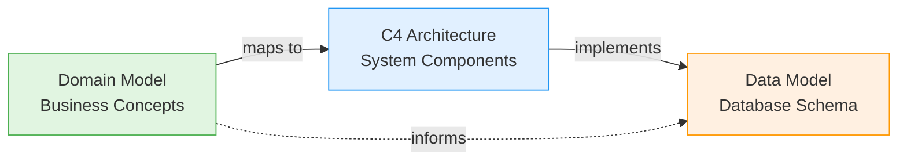

# Trustify Architecture Documentation

This document provides an organized overview of Trustify's architecture from multiple perspectives. Each view serves a different purpose and audience.

## Quick Start Guide

**New to Trustify?** Start with the [Domain Model](domain-model.md) to understand business concepts, then review the [C4 Architecture](architecture.md) to see how components work together.

**Working on database changes?** Go directly to the [Data Model](data-model.md).

**Designing new features?** Use the [Domain Model](domain-model.md) for concepts and [C4 Architecture](architecture.md) for service boundaries.

## Architecture Views

Trustify's architecture is documented through three complementary views following industry-standard modeling approaches:

- **[Domain Model](domain-model.md)** - Business concepts and relationships
  - **Audience:** Product managers, domain experts, developers
  - **When to Use:** Understanding terminology, feature planning, API design

- **[C4 Architecture](architecture.md)** - System decomposition and component interactions
  - **Audience:** Architects, developers, DevOps
  - **When to Use:** System design, deployment planning, integration work

- **[Data Model](data-model.md)** - Physical database schema
  - **Audience:** DBAs, backend developers
  - **When to Use:** Database queries, migrations, schema changes

### Domain Model (Business View)

**Standard:** Domain-Driven Design (DDD) concepts  
[View Domain Model →](domain-model.md)

High-level business entities organized into logical domains:

- **Supply Chain Intelligence**: SBOM, Package, File, License
- **Security Intelligence**: Advisory, Vulnerability, Weakness
- **Product Management**: Organization, Product, ProductVersion
- **Data Pipeline**: Importer, Ingestor, SourceDocument, Storage
- **Analysis & Query**: Analysis Graph (DAG), Query Service

### C4 Architecture (System View)

**Standard:** C4 Model (Context, Container, Component, Code)  
[View C4 Architecture →](architecture.md)

Hierarchical view showing system decomposition at multiple zoom levels:

- **Level 1 - System Context**: External systems and users
- **Level 2 - Container Diagram**: Runtime components and interactions
- **Level 3 - Component Diagrams**: Internal structure of containers

### Data Model (Implementation View)

**Standard:** Entity-Relationship Diagram (ERD)  
[View Data Model →](data-model.md)

PostgreSQL database schema with 50+ tables:

- Primary keys (PK) and foreign keys (FK) explicitly marked
- Cardinality shown with crow's foot notation
- Data types specified for each column
- Organized by domain

### Relationship Between Views



- **Domain Model → C4 Architecture**: Business entities map to services and components
- **C4 Architecture → Data Model**: Services read/write database tables
- **Domain Model → Data Model**: Conceptual entities normalize into database tables

---

## Key Architectural Concepts

### Two-Model Architecture

Trustify maintains two distinct graph representations:

1. **Logical Model** (Database): Preserves exact SBOM relationships with original directionality
2. **Conceptual Model** (Analysis Graph): Normalized DAG view for efficient traversal queries

See [ADR-00002: Analysis Graph API](../adrs/00002-analysis-graph.md) for details.

### Modulith Structure

Services are organized into modules following a consistent pattern:

- `endpoints/` - HTTP API handlers
- `model/` - Serializable data models
- `service/` - Business logic layer
- Tests co-located with implementation

See [modules/README.md](../../modules/README.md) for module conventions.

### PURL Hierarchy

Packages are identified using a three-tier PURL structure:

- **BasePurl**: type, namespace, name
- **VersionedPurl**: adds version to BasePurl
- **QualifiedPurl**: adds qualifiers (platform, arch, etc.)

This enables efficient deduplication and version range queries.

---

## Subsystem Design Documentation

These documents provide deep dives into specific subsystems and design patterns:

### Core Subsystems

| Document                             | Topics Covered                                                          |
| ------------------------------------ | ----------------------------------------------------------------------- |
| [**Importer System**](importer.md)   | Configuration, scheduling, job execution, error handling                |
| [**SBOM Storage**](sbom.md)          | Node types, graph structure, PURL/CPE resolution, cross-SBOM references |
| [**Product Model**](products.md)     | Product hierarchy, version ranges, SBOM associations, status tracking   |
| [**Labels System**](labels.md)       | Flexible metadata, JSONB implementation, query patterns                 |
| [**API Patterns**](fetch-service.md) | Head/Summary/Details DTOs, relationship traversal, pagination           |

### Architecture Decision Records (ADRs)

ADRs document significant architectural decisions with context, rationale, and consequences:

- [**ADR-00001**: Graph Analytics](../adrs/00001-graph-analytics.md) - Foundation of graph-based analysis
- [**ADR-00002**: Analysis Graph API](../adrs/00002-analysis-graph.md) - Logical vs conceptual model separation
- [**ADR-00003**: External References](../adrs/00003-external-references.md) - Cross-SBOM reference handling
- [**ADR-00004**: Advisory Scores](../adrs/00004-advisory-scores.md) - CVSS score management
- [**ADR-00009**: Conservative PURL Garbage Collection](../adrs/00009-conservative-purl-garbage-collection.md) - Data retention strategy
- [**ADR-00011**: CSAF Remediation](../adrs/00011-csaf-remediation.md) - Advisory remediation handling

[View all ADRs →](../adrs/)

ADRs are immutable once accepted. New decisions that supersede old ones reference the original ADR rather than modifying it.

## Module Structure

Trustify follows a **modulith architecture** where the codebase is organized into cohesive modules with clear boundaries, deployed as a single application.

**Module Layout Standard:**

Each module in `modules/` follows a consistent structure:

```
modules/my_module/
├── src/
│   ├── endpoints/     # HTTP API handlers (Actix-web routes)
│   ├── model/         # Serializable DTOs for API responses
│   ├── service/       # Business logic layer
│   └── lib.rs         # Module entry point
└── Cargo.toml
```

**Key Principles:**

- **Endpoints**: Pure routing and HTTP concerns, thin handlers that delegate to services
- **Models**: Data Transfer Objects (DTOs) with `serde` and `utoipa` annotations for API documentation
- **Services**: Core business logic, accepts database connections, returns domain results
- **Co-located Tests**: Tests live alongside implementation for better maintainability

**Benefits:**

- **Clear Boundaries**: Modules encapsulate related functionality
- **Independent Testing**: Each module can be tested in isolation
- **Flexible Deployment**: Could be extracted to separate services if needed
- **Team Ownership**: Teams can own specific modules
- **Reduced Coupling**: Explicit dependencies between modules

**Current Modules:**

- `fundamental/` - Core entities (Advisory, SBOM, PURL, Vulnerability, Product)
- `ingestor/` - Document parsing and storage
- `importer/` - Scheduled import management
- `analysis/` - Dependency graph analysis
- `storage/` - Storage backend abstraction
- `graphql/` - GraphQL API alternative
- `ui/` - Web interface
- `user/` - User preferences management

[Learn more about module conventions →](../../modules/README.md)

## API Documentation

Trustify provides comprehensive OpenAPI 3.0 documentation for all REST endpoints, automatically generated from code annotations using `utoipa`.

[View OpenAPI Specification →](../../openapi.yaml)

The API follows REST principles with consistent patterns as documented in [API Patterns](fetch-service.md).

## Contributing to Documentation

### When to Update Documentation

- **Domain Model**: When adding new business entities or relationships
- **C4 Architecture**: When adding services, changing interactions, or deployment
- **Data Model**: After migrations that add/modify tables
- **Keep views in sync** to maintain documentation quality

### Generating Diagram Images

#### Using Mermaid CLI

Install from https://github.com/mermaid-js/mermaid-cli or use the pre-built Docker image.

**Basic command:**

```bash
mmdc -i domain-model.md -o domain-model.png
```

**With configuration:**

```bash
mmdc -c mermaid.json -i domain-model.md -o domain-model.png
```

**For large diagrams (data model):**

```bash
mmdc -c mermaid.json -i data-model.md -o data-model.png --width 1200 --height 1600 --scale 6
```

**Note:** When providing a markdown file, `mmdc` extracts all Mermaid diagrams and saves them as individual files with incremental suffixes (e.g., `domain-model-1.png`, `domain-model-2.png`).
