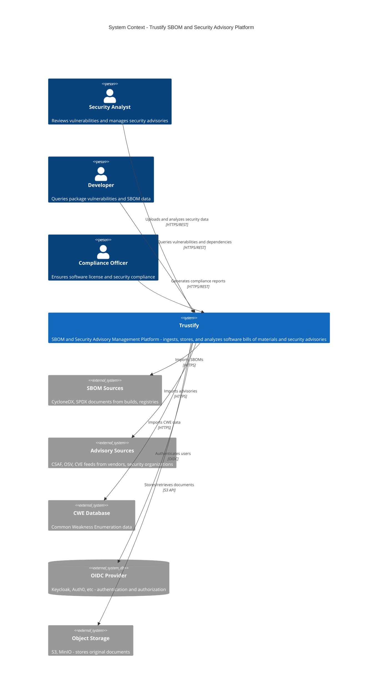
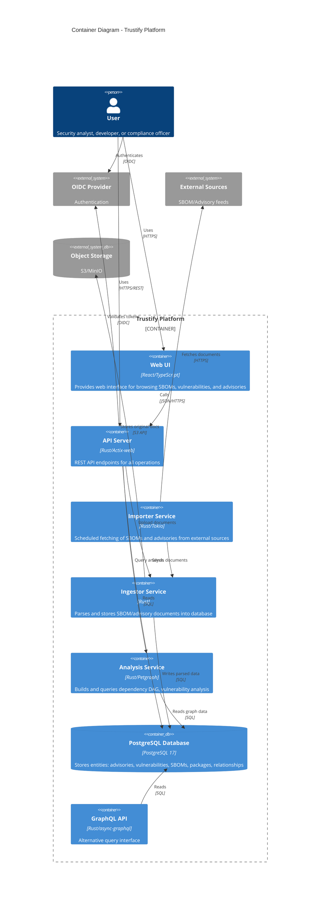
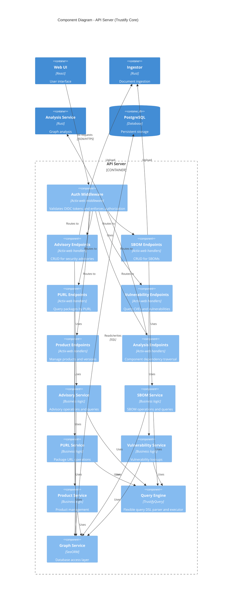
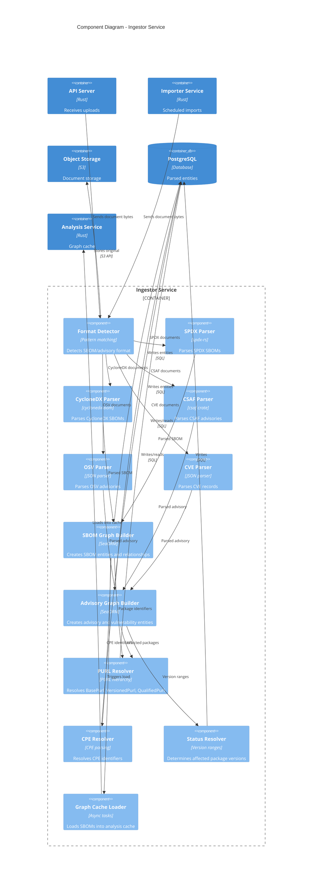

# Trustify Architecture

This document presents Trustify's architecture using the C4 model (Context, Container, Component, Code).

## Level 1: System Context

Shows how Trustify fits into the broader security and supply chain ecosystem.

## Level 2: Container Diagram

Shows the high-level technology and architectural components of Trustify.

## Level 3: Component Diagram - API Server

Shows the internal components and services within the API Server.

## Level 4: Component Diagram - Ingestor Service

Shows how document ingestion and parsing works.

