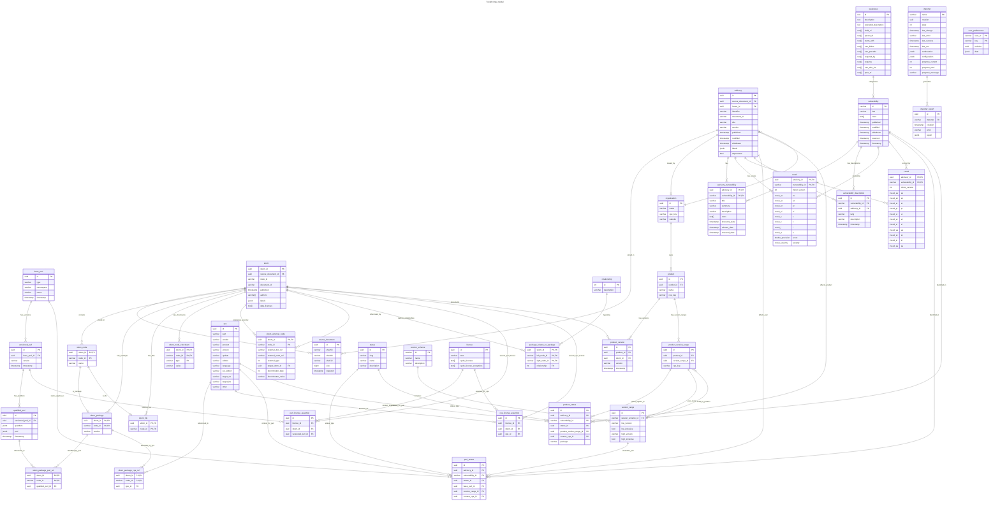

# Trustify Data Model

This is the physical database schema showing tables and their relationships.

```mermaid
---
title: Trustify Data model
---
erDiagram
    %% Core Documents
    source_document {
        uuid id PK
        varchar sha256
        varchar sha384
        varchar sha512
        bigint size
        timestamp ingested
    }

    %% Advisory Domain
    advisory {
        uuid id PK
        uuid source_document_id FK
        uuid issuer_id FK
        varchar identifier
        varchar document_id
        varchar title
        varchar version
        timestamp published
        timestamp modified
        timestamp withdrawn
        jsonb labels
        bool deprecated
    }

    vulnerability {
        varchar id PK
        varchar title
        text[] cwes
        timestamp published
        timestamp modified
        timestamp withdrawn
        timestamp reserved
        timestamp timestamp
    }

    advisory_vulnerability {
        uuid advisory_id PK,FK
        varchar vulnerability_id PK,FK
        varchar title
        varchar summary
        varchar description
        text[] cwes
        timestamp discovery_date
        timestamp release_date
        timestamp reserved_date
    }

    vulnerability_description {
        uuid id PK
        varchar vulnerability_id FK
        uuid advisory_id FK
        varchar lang
        varchar description
        timestamp timestamp
    }

    weakness {
        text id PK
        text description
        text extended_description
        text[] child_of
        text[] parent_of
        text[] starts_with
        text[] can_follow
        text[] can_precede
        text[] required_by
        text[] requires
        text[] can_also_be
        text[] peer_of
    }

    cvss3 {
        uuid advisory_id PK,FK
        varchar vulnerability_id PK,FK
        int minor_version
        cvss3_av av
        cvss3_ac ac
        cvss3_pr pr
        cvss3_ui ui
        cvss3_s s
        cvss3_c c
        cvss3_i i
        cvss3_a a
        double_precision score
        cvss3_severity severity
    }

    cvss4 {
        uuid advisory_id PK,FK
        varchar vulnerability_id PK,FK
        int minor_version
        cvss4_av av
        cvss4_ac ac
        cvss4_at at
        cvss4_pr pr
        cvss4_ui ui
        cvss4_vc vc
        cvss4_vi vi
        cvss4_va va
        cvss4_sc sc
        cvss4_si si
        cvss4_sa sa
    }

    %% PURL Hierarchy
    base_purl {
        uuid id PK
        varchar type
        varchar namespace
        varchar name
        timestamp timestamp
    }

    versioned_purl {
        uuid id PK
        uuid base_purl_id FK
        varchar version
        timestamp timestamp
    }

    qualified_purl {
        uuid id PK
        uuid versioned_purl_id FK
        jsonb qualifiers
        jsonb purl
        timestamp timestamp
    }

    %% SBOM Domain
    sbom {
        uuid sbom_id PK
        uuid source_document_id FK
        varchar node_id
        varchar document_id
        timestamp published
        varchar[] authors
        jsonb labels
        text[] data_licenses
    }

    sbom_node {
        uuid sbom_id PK,FK
        varchar node_id PK
        varchar name
    }

    sbom_package {
        uuid sbom_id PK,FK
        varchar node_id PK,FK
        varchar version
    }

    sbom_file {
        uuid sbom_id PK,FK
        varchar node_id PK,FK
    }

    sbom_node_checksum {
        uuid sbom_id PK,FK
        varchar node_id PK,FK
        varchar type PK
        varchar value
    }

    sbom_package_purl_ref {
        uuid sbom_id PK,FK
        varchar node_id PK,FK
        uuid qualified_purl_id FK
    }

    sbom_package_cpe_ref {
        uuid sbom_id PK,FK
        varchar node_id PK,FK
        uuid cpe_id FK
    }

    sbom_external_node {
        uuid sbom_id PK,FK
        varchar node_id PK
        varchar external_doc_ref
        varchar external_node_ref
        int external_type
        uuid target_sbom_id FK
        int discriminator_type
        varchar discriminator_value
    }

    package_relates_to_package {
        uuid sbom_id PK,FK
        varchar left_node_id PK,FK
        varchar right_node_id PK,FK
        int relationship FK
    }

    relationship {
        int id PK
        varchar description
    }

    %% CPE
    cpe {
        uuid id PK
        varchar part
        varchar vendor
        varchar product
        varchar version
        varchar update
        varchar edition
        varchar language
        varchar sw_edition
        varchar target_sw
        varchar target_hw
        varchar other
    }

    %% Product Domain
    organization {
        uuid id PK
        varchar name
        varchar cpe_key
        varchar website
    }

    product {
        uuid id PK
        uuid vendor_id FK
        varchar name
        varchar cpe_key
    }

    product_version {
        uuid id PK
        uuid product_id FK
        uuid sbom_id FK
        varchar version
        timestamp timestamp
    }

    product_version_range {
        uuid id PK
        uuid product_id FK
        uuid version_range_id FK
        varchar cpe_key
    }

    %% Status
    status {
        uuid id PK
        varchar slug
        varchar name
        varchar description
    }

    purl_status {
        uuid id PK
        uuid advisory_id FK
        varchar vulnerability_id FK
        uuid status_id FK
        uuid base_purl_id FK
        uuid version_range_id FK
        uuid context_cpe_id FK
    }

    product_status {
        uuid id PK
        uuid advisory_id FK
        varchar vulnerability_id FK
        uuid status_id FK
        uuid product_version_range_id FK
        uuid context_cpe_id FK
        varchar package
    }

    %% Version Management
    version_scheme {
        varchar id PK
        varchar name
        varchar description
    }

    version_range {
        uuid id PK
        varchar version_scheme_id FK
        varchar low_version
        bool low_inclusive
        varchar high_version
        bool high_inclusive
    }

    %% License
    license {
        uuid id PK
        varchar text
        text[] spdx_licenses
        text[] spdx_license_exceptions
    }

    purl_license_assertion {
        uuid id PK
        uuid license_id FK
        uuid sbom_id FK
        uuid versioned_purl_id FK
    }

    cpe_license_assertion {
        uuid id PK
        uuid license_id FK
        uuid sbom_id FK
        uuid cpe_id FK
    }

    %% Importer
    importer {
        varchar name PK
        uuid revision
        int state
        timestamp last_change
        varchar last_error
        timestamp last_success
        timestamp last_run
        jsonb continuation
        jsonb configuration
        int progress_current
        int progress_total
        varchar progress_message
    }

    importer_report {
        uuid id PK
        varchar importer FK
        timestamp creation
        varchar error
        jsonb report
    }

    %% User
    user_preferences {
        varchar user_id PK
        varchar key PK
        uuid revision
        jsonb data
    }

    %% Relationships - Advisory Domain
    advisory ||--o{ source_document : "stored_in"
    advisory ||--o| organization : "issued_by"
    advisory ||--o{ advisory_vulnerability : "has"
    advisory ||--o{ cvss3 : "has_scores"
    advisory ||--o{ cvss4 : "has_scores"
    advisory ||--o{ vulnerability_description : "describes"
    advisory ||--o{ purl_status : "affects_purl"
    advisory ||--o{ product_status : "affects_product"

    vulnerability ||--o{ advisory_vulnerability : "reported_in"
    vulnerability ||--o{ vulnerability_description : "has_descriptions"
    vulnerability ||--o{ cvss3 : "scored_by"
    vulnerability ||--o{ cvss4 : "scored_by"
    vulnerability ||--o{ purl_status : "identified_in"
    vulnerability ||--o{ product_status : "identified_in"

    weakness ||--o{ vulnerability : "categorizes"

    %% Relationships - PURL Hierarchy
    base_purl ||--o{ versioned_purl : "has_versions"
    base_purl ||--o{ purl_status : "status_applies_to"

    versioned_purl ||--o{ qualified_purl : "has_qualifiers"
    versioned_purl ||--o{ purl_license_assertion : "licensed_as"

    qualified_purl ||--o{ sbom_package_purl_ref : "referenced_in"

    %% Relationships - SBOM
    sbom ||--o{ source_document : "stored_in"
    sbom ||--o{ sbom_node : "contains"
    sbom ||--o{ sbom_package : "has_packages"
    sbom ||--o{ sbom_file : "has_files"
    sbom ||--o{ sbom_node_checksum : "has_checksums"
    sbom ||--o{ sbom_external_node : "references_external"
    sbom ||--o{ sbom_external_node : "referenced_by"
    sbom ||--o{ package_relates_to_package : "defines_relationships"
    sbom ||--o{ purl_license_assertion : "asserts_purl_license"
    sbom ||--o{ cpe_license_assertion : "asserts_cpe_license"
    sbom ||--o{ product_version : "documents"

    sbom_node ||--o| sbom_package : "is_package"
    sbom_node ||--o| sbom_file : "is_file"

    sbom_package ||--o{ sbom_package_purl_ref : "identified_by_purl"
    sbom_package ||--o{ sbom_package_cpe_ref : "identified_by_cpe"

    relationship ||--o{ package_relates_to_package : "typed_by"

    %% Relationships - CPE
    cpe ||--o{ sbom_package_cpe_ref : "referenced_in"
    cpe ||--o{ cpe_license_assertion : "licensed_as"
    cpe ||--o{ purl_status : "context_for_purl"
    cpe ||--o{ product_status : "context_for_product"

    %% Relationships - Product
    organization ||--o{ product : "owns"
    organization ||--o{ advisory : "issues"

    product ||--o{ product_version : "has_versions"
    product ||--o{ product_version_range : "has_version_ranges"

    product_version_range ||--o{ product_status : "status_applies_to"
    product_version_range ||--o{ version_range : "uses_range"

    %% Relationships - Status
    status ||--o{ purl_status : "status_type"
    status ||--o{ product_status : "status_type"

    %% Relationships - Version
    version_scheme ||--o{ version_range : "schemes"

    version_range ||--o{ product_version_range : "used_by_product"
    version_range ||--o{ purl_status : "constrains_purl"

    %% Relationships - License
    license ||--o{ purl_license_assertion : "asserted_for_purl"
    license ||--o{ cpe_license_assertion : "asserted_for_cpe"

    %% Relationships - Importer
    importer ||--o{ importer_report : "generates"
```
