# Trustify Data Model

```mermaid
classDiagram
    %% Core Advisory Entities
    class advisory {
        +UUID id
        +UUID issuer_id
        +timestamp published
        +timestamp modified
        +timestamp withdrawn
        +String identifier
        +String title
        +String version
        +String document_id
        +jsonb labels
        +UUID source_document_id
        +bool deprecated
    }

    class advisory_vulnerability {
        +UUID advisory_id
        +String vulnerability_id
        +String title
        +String summary
        +String description
        +timestamp discovery_date
        +timestamp release_date
        +timestamp reserved_date
        +text[] cwes
    }

    %% Vulnerability & Weakness
    class vulnerability {
        +String id
        +String title
        +timestamp published
        +timestamp modified
        +timestamp withdrawn
        +timestamp reserved
        +text[] cwes
    }

    class vulnerability_description {
        +UUID id
        +String vulnerability_id
        +UUID advisory_id
        +String lang
        +String description
        +timestamp timestamp
    }

    class weakness {
        +text id
        +text description
        +text extended_description
        +text[] child_of
        +text[] parent_of
        +text[] starts_with
        +text[] can_follow
        +text[] can_precede
        +text[] required_by
        +text[] requires
        +text[] can_also_be
        +text[] peer_of
    }

    %% CVSS Scoring
    class cvss3 {
        +int minor_version
        +UUID advisory_id
        +String vulnerability_id
        +cvss3_av av
        +cvss3_ac ac
        +cvss3_pr pr
        +cvss3_ui ui
        +cvss3_s s
        +cvss3_c c
        +cvss3_i i
        +cvss3_a a
        +double score
        +cvss3_severity severity
    }

    class cvss4 {
        +int minor_version
        +UUID advisory_id
        +String vulnerability_id
        +cvss4_av av
        +cvss4_ac ac
        +cvss4_at at
        +cvss4_pr pr
        +cvss4_ui ui
        +cvss4_vc vc
        +cvss4_vi vi
        +cvss4_va va
        +cvss4_sc sc
        +cvss4_si si
        +cvss4_sa sa
    }

    %% PURL Hierarchy (Package URLs)
    class base_purl {
        +UUID id
        +timestamp timestamp
        +String type
        +String namespace
        +String name
    }

    class versioned_purl {
        +UUID id
        +UUID base_purl_id
        +String version
        +timestamp timestamp
    }

    class qualified_purl {
        +UUID id
        +UUID versioned_purl_id
        +jsonb qualifiers
        +jsonb purl
        +timestamp timestamp
    }

    %% SBOM (Software Bill of Materials)
    class sbom {
        +UUID sbom_id
        +String node_id
        +String document_id
        +timestamp published
        +String[] authors
        +jsonb labels
        +UUID source_document_id
        +text[] data_licenses
    }

    class sbom_node {
        +UUID sbom_id
        +String node_id
        +String name
    }

    class sbom_package {
        +UUID sbom_id
        +String node_id
        +String version
    }

    class sbom_file {
        +UUID sbom_id
        +String node_id
    }

    class sbom_node_checksum {
        +UUID sbom_id
        +String node_id
        +String type
        +String value
    }

    class sbom_external_node {
        +UUID sbom_id
        +String node_id
        +String external_doc_ref
        +String external_node_ref
        +int external_type
        +UUID target_sbom_id
        +int discriminator_type
        +String discriminator_value
    }

    class sbom_package_purl_ref {
        +UUID sbom_id
        +String node_id
        +UUID qualified_purl_id
    }

    class sbom_package_cpe_ref {
        +UUID sbom_id
        +String node_id
        +UUID cpe_id
    }

    class package_relates_to_package {
        +UUID sbom_id
        +String left_node_id
        +int relationship
        +String right_node_id
    }

    class relationship {
        +int id
        +String description
    }

    %% CPE (Common Platform Enumeration)
    class cpe {
        +UUID id
        +String part
        +String vendor
        +String product
        +String version
        +String update
        +String edition
        +String language
        +String sw_edition
        +String target_sw
        +String target_hw
        +String other
    }

    %% Product Management
    class organization {
        +UUID id
        +String name
        +String cpe_key
        +String website
    }

    class product {
        +UUID id
        +UUID vendor_id
        +String name
        +String cpe_key
    }

    class product_version {
        +UUID id
        +UUID product_id
        +UUID sbom_id
        +String version
        +timestamp timestamp
    }

    class product_version_range {
        +UUID id
        +UUID product_id
        +UUID version_range_id
        +String cpe_key
    }

    %% Status Management
    class status {
        +UUID id
        +String slug
        +String name
        +String description
    }

    class purl_status {
        +UUID id
        +UUID advisory_id
        +UUID status_id
        +UUID base_purl_id
        +UUID version_range_id
        +String vulnerability_id
        +UUID context_cpe_id
    }

    class product_status {
        +UUID id
        +UUID advisory_id
        +String vulnerability_id
        +UUID status_id
        +UUID product_version_range_id
        +UUID context_cpe_id
        +String package
    }

    %% Version Range
    class version_range {
        +UUID id
        +String version_scheme_id
        +String low_version
        +bool low_inclusive
        +String high_version
        +bool high_inclusive
    }

    class version_scheme {
        +String id
        +String name
        +String description
    }

    %% License Management
    class license {
        +UUID id
        +String text
        +text[] spdx_licenses
        +text[] spdx_license_exceptions
    }

    class purl_license_assertion {
        +UUID id
        +UUID license_id
        +UUID sbom_id
        +UUID versioned_purl_id
    }

    class cpe_license_assertion {
        +UUID id
        +UUID license_id
        +UUID sbom_id
        +UUID cpe_id
    }

    %% Storage & Import
    class source_document {
        +UUID id
        +String sha256
        +String sha384
        +String sha512
        +bigint size
        +timestamp ingested
    }

    class importer {
        +String name
        +UUID revision
        +int state
        +timestamp last_change
        +String last_error
        +timestamp last_success
        +timestamp last_run
        +jsonb continuation
        +jsonb configuration
        +int progress_current
        +int progress_total
        +String progress_message
    }

    class importer_report {
        +UUID id
        +String importer
        +timestamp creation
        +String error
        +jsonb report
    }

    %% User Settings
    class user_preferences {
        +String user_id
        +String key
        +UUID revision
        +jsonb data
    }

    %% Relationships - Advisory
    advisory "1" --> "*" advisory_vulnerability : has
    advisory "1" --> "*" cvss3 : has_scores
    advisory "1" --> "*" cvss4 : has_scores
    advisory "*" --> "1" source_document : stored_in
    advisory "1" --> "*" purl_status : affects
    advisory "1" --> "*" product_status : affects
    advisory "1" --> "*" vulnerability_description : has

    %% Relationships - Vulnerability
    vulnerability "1" --> "*" advisory_vulnerability : reported_in
    vulnerability "1" --> "*" vulnerability_description : has
    vulnerability "1" --> "*" cvss3 : has_scores
    vulnerability "1" --> "*" cvss4 : has_scores
    weakness "1" --> "*" vulnerability : categorizes

    %% Relationships - PURL Hierarchy
    base_purl "1" --> "*" versioned_purl : has_versions
    versioned_purl "1" --> "*" qualified_purl : has_qualifiers
    qualified_purl "1" --> "*" sbom_package_purl_ref : referenced_in

    %% Relationships - SBOM Structure
    sbom "1" --> "*" sbom_node : contains
    sbom_node "1" <|-- sbom_package : is_a
    sbom_node "1" <|-- sbom_file : is_a
    sbom "1" --> "*" sbom_node_checksum : has
    sbom "1" --> "*" sbom_external_node : references
    sbom "1" --> "*" package_relates_to_package : defines_relationships
    sbom "*" --> "1" source_document : stored_in

    sbom_package "1" --> "*" sbom_package_purl_ref : has
    sbom_package "1" --> "*" sbom_package_cpe_ref : has

    package_relates_to_package "*" --> "1" relationship : type
    sbom_external_node "*" --> "1" sbom : external_reference

    %% Relationships - Product
    organization "1" --> "*" product : owns
    product "1" --> "*" product_version : has
    product "1" --> "*" product_version_range : has
    product_version "*" --> "0..1" sbom : documented_by
    product_version_range "*" --> "1" version_range : uses

    %% Relationships - Status
    purl_status "*" --> "1" base_purl : applies_to
    purl_status "*" --> "1" status : has
    purl_status "*" --> "1" advisory : from
    purl_status "*" --> "1" version_range : version_constraint
    purl_status "*" --> "0..1" cpe : context

    product_status "*" --> "1" status : has
    product_status "*" --> "1" advisory : from
    product_status "*" --> "1" product_version_range : applies_to
    product_status "*" --> "0..1" cpe : context

    %% Relationships - CPE & License
    cpe "1" --> "*" sbom_package_cpe_ref : referenced_in
    cpe "1" --> "*" cpe_license_assertion : has

    license "1" --> "*" purl_license_assertion : asserted_for
    license "1" --> "*" cpe_license_assertion : asserted_for

    purl_license_assertion "*" --> "1" versioned_purl : applies_to
    purl_license_assertion "*" --> "1" sbom : in_context
    cpe_license_assertion "*" --> "1" sbom : in_context

    %% Relationships - Version
    version_range "*" --> "1" version_scheme : uses_scheme

    %% Relationships - Import
    importer "1" --> "*" importer_report : generates

    %% Notes
    note for base_purl "PURL base: type, namespace, name only"
    note for versioned_purl "Adds version to base PURL"
    note for qualified_purl "Adds qualifiers (jsonb) to versioned PURL"
    note for sbom "Root node for Software Bill of Materials"
    note for advisory "Security advisory document"
    note for vulnerability "CVE or other vulnerability identifier"
```

## Key Design Patterns

### PURL Three-Tier Hierarchy

The Package URL (PURL) structure uses a normalized three-tier approach:

- **BasePurl**: Identifies package type, namespace, and name
- **VersionedPurl**: References BasePurl + adds version
- **QualifiedPurl**: References VersionedPurl + adds qualifiers (stored as JSONB)

### SBOM Node Hierarchy

SBOM nodes use a discriminated union pattern:

- **sbom_node**: Base table with common attributes
- **sbom_package**: Extends node with package-specific attributes
- **sbom_file**: Extends node for file entries

### Relationship Graph

Package relationships are modeled as a directed graph:

- `package_relates_to_package` defines edges
- `relationship` enum defines edge types (Contains, Dependency, etc.)
- Supports transitive queries via PostgreSQL functions

### Status Tracking

Dual status tracking for both package URLs and products:

- **purl_status**: Tracks vulnerability status for specific PURLs
- **product_status**: Tracks vulnerability status for products/versions

### Version Matching

Flexible version comparison using:

- `version_scheme`: Defines versioning semantics (semver, rpm, maven, python, etc.)
- `version_range`: Defines inclusive/exclusive bounds
- PostgreSQL functions for version comparison per scheme
