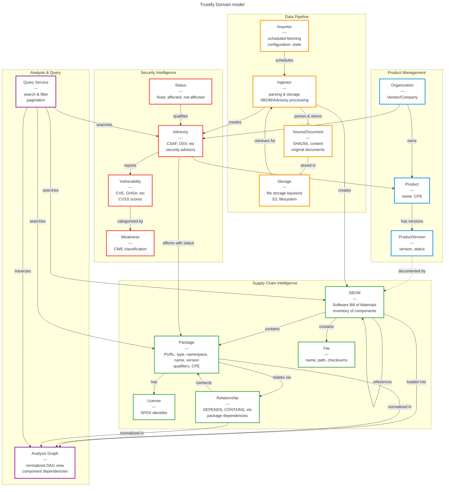

# Trustify Domain Model

This is a high-level conceptual view of the core domain objects and their relationships.

```mermaid
---
title: Trustify Domain model
---
graph TB
    subgraph Supply["Supply Chain Intelligence"]
        SBOM[SBOM<br/>---<br/>Software Bill of Materials<br/>inventory of components]
        Package[Package<br/>---<br/>PURL: type, namespace, name, version<br/>qualifiers, CPE]
        File[File<br/>---<br/>name, path, checksums]
        License[License<br/>---<br/>SPDX identifier]
        Relationship[Relationship<br/>---<br/>DEPENDS, CONTAINS, etc<br/>package dependencies]
    end

    subgraph Security["Security Intelligence"]
        Advisory[Advisory<br/>---<br/>CSAF, OSV, etc<br/>security advisory]
        Vulnerability[Vulnerability<br/>---<br/>CVE, GHSA, etc<br/>CVSS scores]
        Weakness[Weakness<br/>---<br/>CWE classification]
        Status[Status<br/>---<br/>fixed, affected, not-affected]
    end

    subgraph Products["Product Management"]
        Organization[Organization<br/>---<br/>Vendor/Company]
        Product[Product<br/>---<br/>name, CPE]
        ProductVersion[ProductVersion<br/>---<br/>version, status]
    end

    subgraph DataPipeline["Data Pipeline"]
        Importer[Importer<br/>---<br/>scheduled fetching<br/>configuration, state]
        Ingestor[Ingestor<br/>---<br/>parsing & storage<br/>SBOM/Advisory processing]
        SourceDocument[SourceDocument<br/>---<br/>SHA256, content<br/>original documents]
        Storage[Storage<br/>---<br/>file storage backend<br/>S3, filesystem]
    end

    subgraph Analysis["Analysis & Query"]
        AnalysisGraph[Analysis Graph<br/>---<br/>normalized DAG view<br/>component dependencies]
        Query[Query Service<br/>---<br/>search & filter<br/>pagination]
    end

    %% SBOM relationships
    SBOM -->|contains| Package
    SBOM -->|contains| File
    SBOM -->|references| SBOM
    Package -->|relates via| Relationship
    Relationship -->|connects| Package
    Package -->|has| License

    %% Security relationships
    Advisory -->|reports| Vulnerability
    Advisory -->|affects with status| Package
    Advisory -->|affects with status| Product
    Status -->|qualifies| Advisory
    Vulnerability -->|categorized by| Weakness

    %% Product relationships
    Organization -->|owns| Product
    Organization -->|issues| Advisory
    Product -->|has versions| ProductVersion
    ProductVersion -.->|documented by| SBOM

    %% Data pipeline
    Importer -->|schedules| Ingestor
    Ingestor -->|parses & stores| SourceDocument
    Ingestor -->|creates| SBOM
    Ingestor -->|creates| Advisory
    SourceDocument -->|stored in| Storage
    Storage -->|retrieves for| Ingestor

    %% Analysis
    SBOM -->|loaded into| AnalysisGraph
    Package -->|normalized in| AnalysisGraph
    Relationship -->|normalized in| AnalysisGraph
    Query -->|searches| SBOM
    Query -->|searches| Advisory
    Query -->|searches| Package
    Query -->|traverses| AnalysisGraph

    classDef supply fill:#fff,stroke:#4caf50,stroke-width:3px
    classDef security fill:#fff,stroke:#f44336,stroke-width:3px
    classDef product fill:#fff,stroke:#2196f3,stroke-width:3px
    classDef pipeline fill:#fff,stroke:#ff9800,stroke-width:3px
    classDef analysis fill:#fff,stroke:#9c27b0,stroke-width:3px

    class SBOM,Package,File,License,Relationship supply
    class Advisory,Vulnerability,Weakness,Status security
    class Organization,Product,ProductVersion product
    class Importer,Ingestor,SourceDocument,Storage pipeline
    class AnalysisGraph,Query analysis
```
